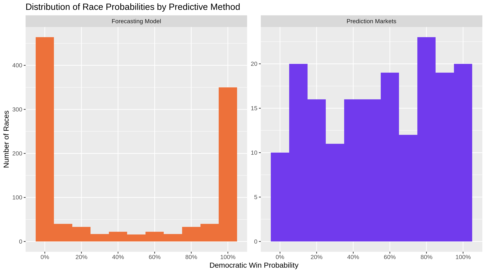
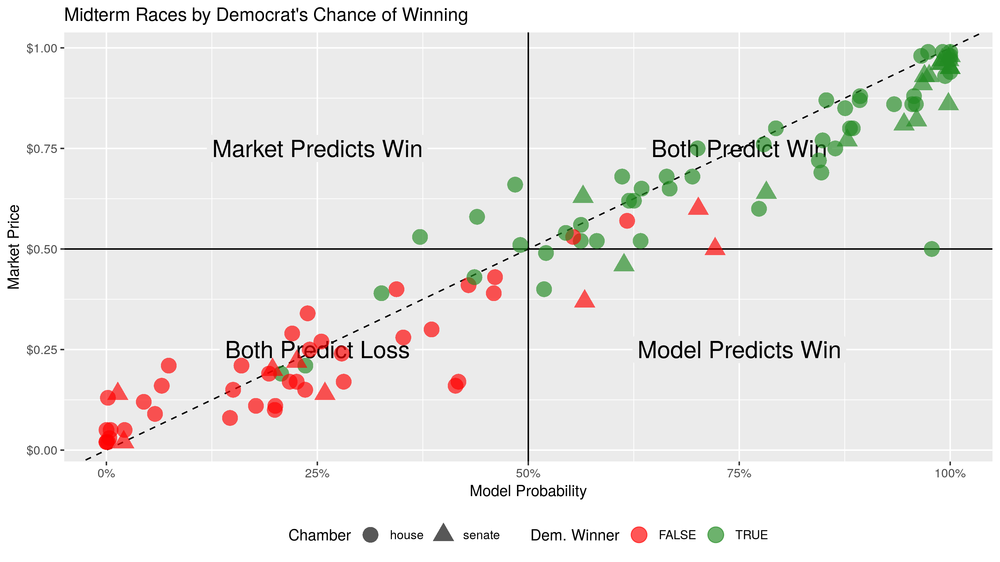
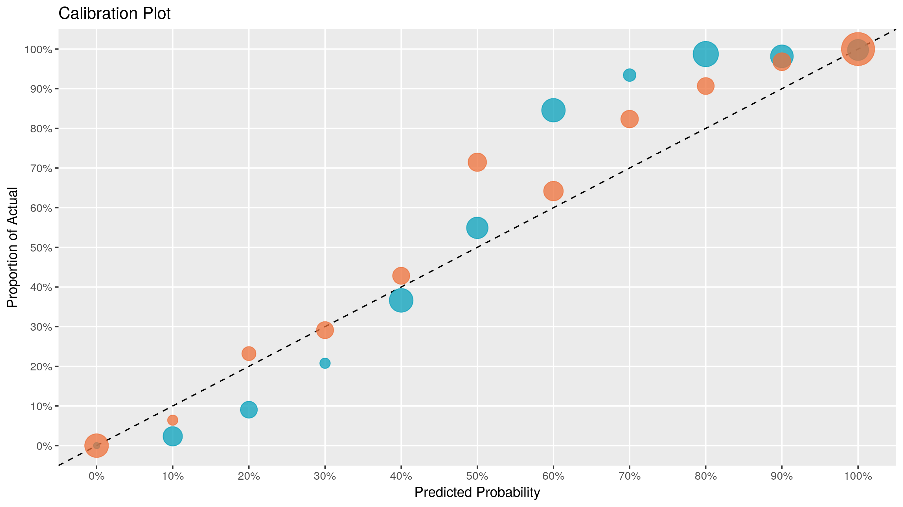
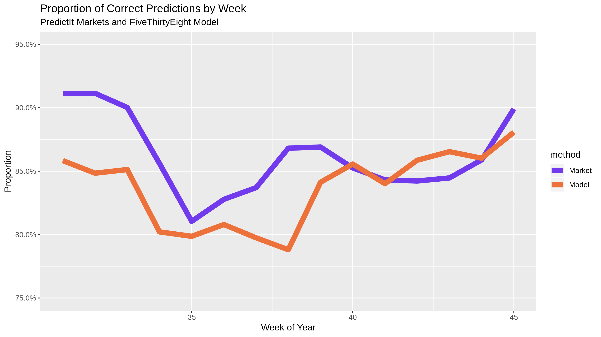
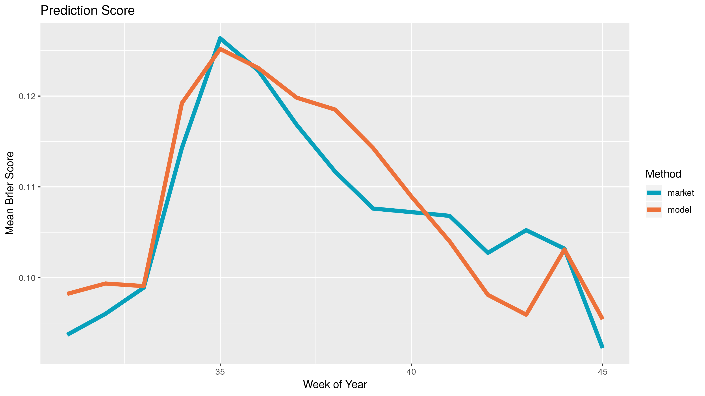

```{r setup, include=FALSE}
library(tidyverse)
library(lubridate)
library(magrittr)
library(wayback)
library(pander)
library(knitr)
opts_chunk$set(
  warning = FALSE,
  message = FALSE,
  error = FALSE,
  echo = FALSE,
  eval = FALSE
)
```

## Introduction

Election prediction helps party officials, campaign operatives, and journalists
interpret campaigns in a quantitative manner. Uncertainty is key to a useful
election prediction.

The forecast model has become a staple of political punditry in recent years.
Popularized by the data journalist at [FiveThirtyEight][01], the forecasting
model is a statistical tool used to incorporate a number of quantitative inputs
and output a _probabilistic_ view of all possible outcomes.

Prediction markets can be used as alternative method of generating similarly
probabilistic views of election outcomes. Markets utilize the economic forces of
price discovery and risk aversion to overcome the ideological bias of
self-interested traders on a binary options exchange.

Can markets predict elections better than the models? If so, under what
conditions?

I propose a null hypothesis of no difference between the proportion of accurate
predictions made by forecasting models and prediction markets in the 2018
congressional midterm elections.

## Reproducibility

All public input data has been saved on the [internet archive][28] and can be
accessed through their wayback machine.

Data manipulation is done primarily using R packages from the [`tidyverse`][29]
collection. Installing those packages should contain all functions needed to run
the project.

```{r install, echo=TRUE, eval = FALSE}
# devtools::install_cran("here")
# devtools::install_cran("tidyverse")
# devtools::install_cran("verification")
# devtools::install_github("hrbrmstr/wayback")
```

```{r library, echo=TRUE, eval = FALSE}
library(verification)
library(tidyverse)
library(lubridate)
library(magrittr)
library(wayback)
```

Package versions are maintained through [`packrat`][32].

The R scripts in the [`/code`](/code) folder can be run in sequential order to
reproduce the results. There are four scripts:

1. Read archived data with `wayback` and `readr`
1. Wrangle and format with `dplyr` and `tidyr`
1. Evaluate predictions with `stats` and `verification`
1. Communicate results with `ggplot2` and `rmarkdown`

```{r source, echo=TRUE, eval = FALSE}
source("code/01_read_inputs.R")
source("code/02_format_inputs.R")
source("code/03_compare_methods.R")
source("code/04_explore_visually.R")
```

## Forecasting Models

I will be using the FiveThirtyEight "classic" model to represent the best
capabilities of statistical election forecasting. FiveThirtyEight has a track
record of accuracy over the last decade.

[According to Nate Silver][21], the goal of these models is "not to divine some
magic formula that miraculously predicts every election. Instead, it’s to make
sense of publicly available information in a rigorous and disciplined way."

To achieve this, [Silver explains][08] that most models "take lots of polls,
perform various types of adjustments to them, and then blend them with other
kinds of empirically useful indicators to forecast each race". Most importantly,
"they account for the uncertainty in the forecast and simulate the election
thousands of times" to generate a probabilistic forecast.

The model incorporates three types of inputs:

1. **Polling:** District level polling, adjusted by [pollster rating][09]
1. **CANTOR:** An algorithm to impute polling from districts without any
1. **Fundamentals:** Historically useful non-polling factors:
    * Scandals
    * Incumbency
    * Fundraising
    * Partisanship
    * Generic ballot
    * Previous margin
    * Incumbent voting
    * Challenger office

From this, model calculates the most likely split of the vote in a race. The
probability distribution around this mean is calculated using proven variables:

1. Fewer polls
1. Lopsided race
1. Election further away
1. More undecideds or third-party voters
1. Polls disagree with other polls or fundamentals

The model is run with a Monte Carlo simulation. Simulated elections are drawn
from the race's probability distribution. The percentage of simulated elections
won represents the probability of victory.

FiveThirtyEight published two files with top-level daily predictions:

1. [`senate_seat_forecast.csv`][12]
1. [`house_district_forecast.csv`][14]

These files contain over 100,000 rows, each a daily predictions from the
"classic" model with 11 variables:

1. Date
1. State
1. District/Class
1. Election type
1. Candidate name
1. Political party
1. Model version
1. **Probability of victory**
1. Expected share of the vote
1. Minimum share
1. Maximum share

```{r model_stats, echo=TRUE, eval=FALSE}
"https://projects.fivethirtyeight.com/congress-model-2018/senate_seat_forecast.csv" %>%
  read_memento(timestamp = "2018-11-06", as = "raw") %>% 
  read_csv(col_types = "Dcdlcclcdddd")
```

```{r model_data, echo=FALSE, eval=TRUE}
"https://projects.fivethirtyeight.com/congress-model-2018/senate_seat_forecast.csv" %>%
  read_memento(timestamp = "2018-11-06", as = "raw") %>% 
  read_csv(col_types = "Dcdlcclcdddd") %>% 
  filter(forecastdate == "2018-11-05", model == "classic") %>% 
  select(forecastdate, state, party, incumbent, win_probability, voteshare) %>%
  arrange(state) %>%
  slice(1:8) %>%
  kable(format = "markdown",
        digits = 3,
        col.names = c("Date", 
                      "State", 
                      "Party",
                      "Incumbent",
                      "Probability", 
                      "Vote Share"),
        caption = "Senate Seat Model")
```

## Prediction Markets

Prediction markets generate probabilistic forecasts by crowd-sourcing the
collection of data from self-interested and risk averse traders. 
[The efficient market hypothesis][30] holds that asset prices reflect _all_
available information (including forecasting models). Markets have traders put
their money where their mouth is when predicting elections.

PredictIt is an exchange run by Victoria University of Wellington, New Zealand.
The site offers a continuous double-auction exchange, where traders buy and sell
shares of futures contracts tied to election outcomes. As a trader's perception
of probabilities changes, they can sell owned shares, causing the market
equilibrium price to update accordingly.

PredictIt provided the price history in the
[`data/DailyMarketData.csv`](data/DailyMarketData.csv) file. 

1. Market ID
1. Market name
1. Market symbol
1. Contract name
1. Contract symbol
1. Prediction date
1. Opening contract price
1. Low contract price
1. High contract price
1. **Closing contract price**
1. Volume of shares traded

```{r read_market, echo=TRUE, eval=FALSE}
read_delim(file = "data/DailyMarketData.csv",
           col_types = "cccccDddddd",
           delim = "|", 
           na = "n/a")
```

```{r print_market, echo=FALSE, eval=TRUE}
here::here("data", "DailyMarketData.csv") %>% 
  read_delim(delim = "|", na = "n/a", col_types = "cccccDddddd") %>% 
  filter(Date == "2018-11-05") %>% 
  select(MarketSymbol, ContractSymbol, Date, ClosePrice, Volume) %>%
  arrange(MarketSymbol) %>%
  slice(1:8) %>%
  kable(format = "markdown",
        digits = 3,
        col.names = c("Market", "Contract", "Date", "Price", "Volume"),
        caption = "Prediction Market Data")
```

## Wrangling

The above data sets were both formatted to contain two key variables: `date` and
`race`. Together, these can be used to join the two data sets for comparison.

Observations can then be gathered into a single [tidy][19] data frame, with each
observation representing one prediction (on one day, for one party, from one
source). Redundant complimentary predictions are then removed.

These predictions are compared against the election results to evaluate the
two methods.

```{r tidy_joined, echo=TRUE, message=FALSE, eval=FALSE}
inner_join(markets2, model2) %>%
  filter(date %>% between(17744, 17840)) %>%
  rename(model = prob, market = close) %>% 
  gather(model, market, key = method, value = prob) %>%
  inner_join(results) %>%
  mutate(hit = (prob > 0.50) == winner) %>% 
  mutate(score = (prob - winner)^2) 
```

```{r tidy_data, echo=FALSE, message=FALSE, eval=TRUE}
joined <- read_csv("data/hits.csv")
joined %>% 
  arrange(date, race, method) %>% 
  slice(1:10) %>%
  kable(format = "markdown",
        digits = 4,
        col.names = c("Date",
                      "Race",
                      "Method",
                      "Probability",
                      "Accurate",
                      "Score"),
        caption = "Comparison Evaluation")
```

## Exploration







## Results

There is a statistically significant difference between the proportion of
accurate predictions made by the markets vs. the model.

```{r print_brier, echo=FALSE, eval=TRUE}
sums <- joined %>% 
  select(date, race, method, hit) %>%
  spread(key = method,
         value = hit) %>%
  select(market, model) %>%
  colSums()

test <- prop.test(x = sums, n = rep(8750, 2)) 
test$data.name <- "proportion by method"
names(test$estimate) <- c("market proportion", "model proportion")
pander::pander(test)
```



This is not the most useful test for predictive usefulness. The model is
generally more confident in both correct and incorrect predictions. Reducing
probabalistic forecasts to binary correct/incorrect based on the 50% line
removes all nuance.


[The Brier score][31] allows for probablistic forecasts to be meaningfully
tested with for mean squared error. Using this test, there is no statistically
significant difference in the respective skill scores of each predictive method.

```{r print_prop, echo=FALSE, eval=TRUE}
joined %$%
  t.test(formula = score ~ method) %>% 
  pander::pander()
```



[01]: https://fivethirtyeight.com/
[02]: https://projects.fivethirtyeight.com/2016-election-forecast/
[03]: https://www.nytimes.com/interactive/2016/upshot/presidential-polls-forecast.html
[04]: http://elections.huffingtonpost.com/2016/forecast/president
[05]: https://en.wikipedia.org/wiki/Sampling_(statistics)
[06]: https://www.realclearpolitics.com/
[07]: https://en.wikipedia.org/wiki/Law_of_large_numbers
[08]: https://fivethirtyeight.com/methodology/how-fivethirtyeights-house-and-senate-models-work/
[09]: https://projects.fivethirtyeight.com/pollster-ratings/
[10]: https://en.wikipedia.org/wiki/Monte_Carlo_method
[11]: https://projects.fivethirtyeight.com/congress-model-2018/senate_national_forecast.csv
[12]: https://projects.fivethirtyeight.com/congress-model-2018/senate_seat_forecast.csv
[13]: https://projects.fivethirtyeight.com/congress-model-2018/house_national_forecast.csv
[14]: https://projects.fivethirtyeight.com/congress-model-2018/house_district_forecast.csv
[15]: https://www.predictit.org/support/faq
[16]: https://www.predictit.org/research
[17]: https://www.predictit.org/api/marketdata/all/
[18]: https://en.wikipedia.org/wiki/Prediction_market
[19]: http://vita.had.co.nz/papers/tidy-data.html
[20]: https://docs.google.com/spreadsheets/d/1ksBLxRR3GCZd33IvhkcNqqBd5K8HwlWC7YuAkVmS1lg/ 
[21]: https://fivethirtyeight.com/features/how-the-fivethirtyeight-senate-forecast-model-works/
[22]: https://cookpolitical.com/
[23]: https://insideelections.com/
[24]: http://www.centerforpolitics.org/crystalball/
[25]: https://github.com/unitedstates/congress-legislators
[26]: http://53eig.ht/1u2pSbD
[27]: https://www.predictit.org/
[28]: https://archive.org/
[29]: https://github.com/tidyverse/
[30]: https://en.wikipedia.org/wiki/Efficient-market_hypothesis
[31]: https://en.wikipedia.org/wiki/Brier_score
[32]: https://rstudio.github.io/packrat/
