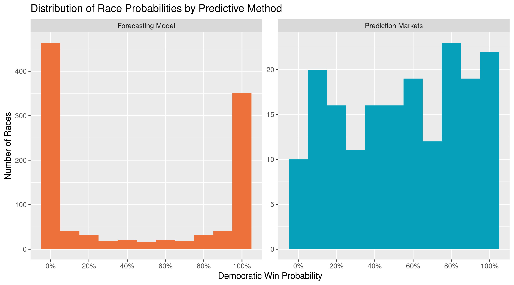
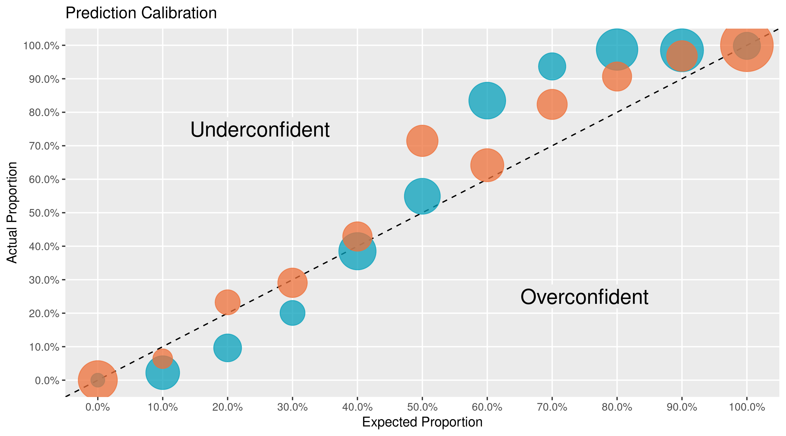

```{r setup, include=FALSE}
library(knitr)
opts_chunk$set(
  warning = FALSE,
  message = FALSE,
  error = FALSE
)
options(width = 99)
```

# Introduction

Election prediction helps party officials, campaign operatives, and journalists interpret campaigns
in a quantitative manner. Uncertainty is key to a useful election prediction.

The forecast model has become a staple of political punditry. Popularized by the data journalist at
[FiveThirtyEight][01], the forecasting model is a statistical tool used to incorporate a number of
quantitative inputs and produce a _probabilistic_ view of all possible outcomes.

Prediction markets can be used to generate similarly probabilistic views of election outcomes by
utilizing the price discovery and risk aversion to overcome the ideological bias of self-interested
traders on a binary options exchange.

**Can markets predict elections better than the models? If so, under what conditions?**
 
I propose a null hypothesis of no in the proportion of correct predictions made by forecasting
models and prediction markets in the 2018 congressional midterm elections.

# Reproduce

All public input data has been saved on the [internet archive][02] and can be accessed through
their wayback machine.

Data manipulation is done using the R language and packages from the [`tidyverse`][03] ecosystem.

```{r p_load, echo=TRUE, eval=TRUE}
# install.package("pacman")
pacman::p_load_gh("hrbrmstr/wayback")
pacman::p_load(
  verification,
  tidyverse,
  lubridate,
  magrittr
)
```

The R scripts in the [`/code`](/code) folder can be run in sequential order to reproduce the
results. There are four scripts to perform four steps:

1. Read archived data with `wayback` and `readr`
1. Wrangle and format with `dplyr` and `tidyr`
1. Evaluate predictions with `stats` and `verification`
1. Communicate results with `ggplot2` and `rmarkdown`

```{r source, echo=TRUE, eval=FALSE}
source("code/01_read_inputs.R")
source("code/02_format_inputs.R")
source("code/03_compare_methods.R")
source("code/04_explore_visually.R")
```

# Data

## Forecasting Models

I will be using the FiveThirtyEight "classic" model to represent the best capabilities of
statistical election forecasting. FiveThirtyEight has a track record of accuracy over the last
decade.

[According to Nate Silver][05], "[the model's] goal is not to divine some magic formula that
miraculously predicts every election. Instead, it’s to make sense of publicly available information
in a rigorous and disciplined way."

To achieve this, [Silver explains][06] that most models (**1**) "take lots of polls, perform
various types of adjustments to them, and then blend them with other kinds of empirically useful
indicators to forecast each race". Importantly, they (**2**) "account for the uncertainty in the
forecast and simulate the election thousands of times" to generate a probabilistic forecast.

The model incorporates three types of inputs:

1. **Polling:** District level polling, adjusted by [pollster rating][07]
1. **CANTOR:** polling imputation for districts without any
1. **Fundamentals:** Historically useful non-polling factors:
    * Scandals
    * Incumbency
    * Fundraising
    * Partisanship
    * Generic ballot
    * Previous margin
    * Incumbent voting
    * Challenger office

From this data, the model (**1**) calculates the most likely split of the vote in a race. (**2**) The
probability distribution around this mean is calculated using proven variables of uncertainty.

The model runs [Monte Carlo simulation][08], drawing elections from the race's probability
distribution. The percentage of simulated elections won represents the probability of victory.

FiveThirtyEight publishes two files with top-level daily predictions:

1. [`senate_seat_forecast.csv`][09]
1. [`house_district_forecast.csv`][10]

Together, there are **110,000** daily prediction from the "classic" model with **11** variables:

1. Date
1. State
1. District/Class
1. Election type
1. Candidate name
1. Political party
1. Model version
1. **Probability of victory**
1. Expected share of the vote
1. Minimum share
1. Maximum share

```{r model_stats, echo=TRUE, eval=FALSE}
read_memento(
    url = "https://projects.fivethirtyeight.com/congress-model-2018/house_district_forecast.csv",
    timestamp = "2018-11-06", 
    as = "parsed"
)
```

```{r model_data, echo=FALSE, eval=TRUE}
"https://projects.fivethirtyeight.com/congress-model-2018/house_district_forecast.csv" %>%
  read_memento(timestamp = "2018-11-06", as = "raw") %>% 
  read_csv(col_types = "Dcdlcclcdddd") %>% 
  filter(forecastdate == "2018-11-05", model == "classic") %>% 
  select(forecastdate, state, district, party, incumbent, win_probability, voteshare) %>%
  arrange(state) %>%
  slice(1:5) %>%
  kable(
    format = "markdown",
    digits = 3,
    col.names = c("Date", "State", "District", "Party", "Incumbent", "Probability", "Vote Share"),
    caption = "Senate Seat Model"
  )
```

## Prediction Markets

Prediction markets generate probabilistic forecasts by crowd-sourcing the collection of data from
self-interested and risk averse traders. [The efficient market hypothesis][11] holds that asset
prices reflect _all_ available information (including forecasting models).

[PredictIt][12] is an exchange run by [Victoria University][13] of Wellington, New Zealand. The
site offers a continuous double-auction exchange, where traders buy and sell shares of futures
contracts tied to election outcomes. As a trader's perception of probabilities changes, they can
sell owned shares. The market equilibrium price to updates to reflect probability.

PredictIt provided the price history in [`data/DailyMarketData.csv`](data/DailyMarketData.csv).
There are nearly **45,000** daily predictions from **112** races with **11** variables:

1. Market ID
1. Market name
1. Market symbol
1. Contract name
1. Contract symbol
1. Prediction date
1. Opening contract price
1. Low contract price
1. High contract price
1. **Closing contract price**
1. Volume of shares traded

```{r read_market, echo=TRUE, eval=FALSE}
read_delim(
  file = "data/DailyMarketData.csv",
  delim = "|",
  col_types = "cccccDddddd",
  na = "n/a"
)
```

```{r print_market, echo=FALSE, eval=TRUE}
here::here("data", "DailyMarketData.csv") %>% 
  read_delim(delim = "|", na = "n/a", col_types = "cccccDddddd") %>% 
  filter(Date == "2018-11-05") %>% 
  select(MarketId, MarketSymbol, ContractSymbol, Date, OpenPrice, ClosePrice, Volume) %>%
  arrange(MarketSymbol) %>%
  slice(1:5) %>%
  kable(
    format = "markdown",
    digits = 3,
    col.names = c("ID", "Market", "Contract", "Date", "Open", "Close", "Volume"),
    caption = "Prediction Market Data"
  )
```

# Wrangle

The above data sets were both formatted to contain key variables: `date`, `race` and `party`. These
are used to join the two data sets for comparison.

Observations are gathered into a single [tidy][14] data set, with each observation representing one
prediction (on one day, for one party, from one source). Redundant complimentary predictions are
then removed.

These predictions are compared against the election results to evaluate the two methods. There are
**17,500** predictions across **90** days, for **111** races. from **2** sources.

```{r tidy_joined, echo=TRUE, message=FALSE, eval=FALSE}
inner_join(markets2, model2) %>%
  filter(date %>% between(17744, 17840)) %>%
  rename(model = prob, 
         market = close) %>% 
  gather(model, market, 
         key = method, 
         value = prob) %>%
  inner_join(results) %>%
  mutate(hit = (prob > 0.50) == winner) %>% 
  mutate(score = (prob - winner)^2) 
```

```{r tidy_data, echo=FALSE, message=FALSE, eval=TRUE}
hits <- read_csv("data/hits.csv") %>% mutate(score = (prob - winner)^2)
hits %>%
  arrange(date, race, method) %>% 
  slice(1:10) %>%
  mutate(party = "D") %>% 
  select(date, race, party, method, prob, hit, score) %>% 
  kable(
    format = "markdown",
    digits = 3,
    col.names = c("Date", "Race",  "Party", "Method", "Probability", "Correct", "Score"),
    caption = "Comparison Evaluation"
  )
```

# Explore






# Results

There is a statistically significant difference between the proportion of accurate predictions made
by the markets and the model.

```{r print_brier, echo=FALSE, eval=TRUE}
sums <- hits %>% 
  select(date, race, method, hit) %>%
  spread(key = method,
         value = hit) %>%
  select(market, model) %>%
  colSums()

test <- prop.test(x = sums, n = rep(8750, 2)) 
test$data.name <- "proportion by method"
names(test$estimate) <- c("market proportion", "model proportion")
pander::pander(test)
```


This is not the most useful test for predictive usefulness. The model is generally more confident
in both correct and incorrect predictions. The markets are less likely to be wrong, but they are
less confident when they are right.


[The Brier score][15] allows for probablistic forecasts to be meaningfully tested with mean squared
error. Using this test, there is no statistically significant difference in the respective skill
scores of each predictive method.

```{r print_prop, echo=FALSE, eval=TRUE}
hits %$%
  t.test(formula = score ~ method) %>% 
  pander::pander()
```


[01]: https://fivethirtyeight.com/
[02]: https://archive.org/
[03]: https://github.com/tidyverse/
[04]: https://rstudio.github.io/packrat/
[05]: http://53eig.ht/1u2pSbD
[06]: https://fivethirtyeight.com/methodology/how-fivethirtyeights-house-and-senate-models-work/
[07]: https://projects.fivethirtyeight.com/pollster-ratings/
[08]: https://en.wikipedia.org/wiki/Monte_Carlo_method
[09]: https://projects.fivethirtyeight.com/congress-model-2018/senate_seat_forecast.csv
[10]: https://projects.fivethirtyeight.com/congress-model-2018/house_district_forecast.csv
[11]: https://en.wikipedia.org/wiki/Efficient-market_hypothesis
[12]: https://www.predictit.org/
[13]: https://www.victoria.ac.nz/
[14]: http://vita.had.co.nz/papers/tidy-data.html
[15]: https://en.wikipedia.org/wiki/Brier_score
