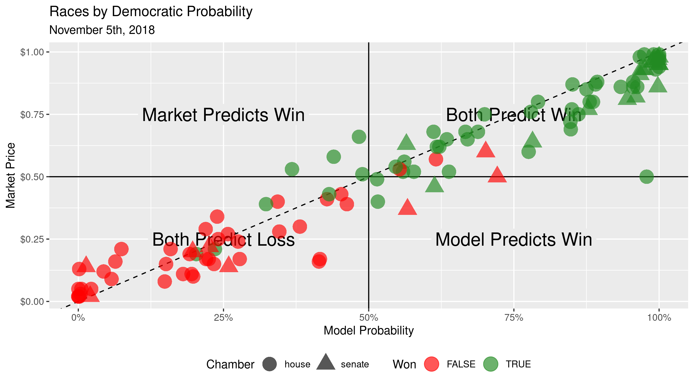
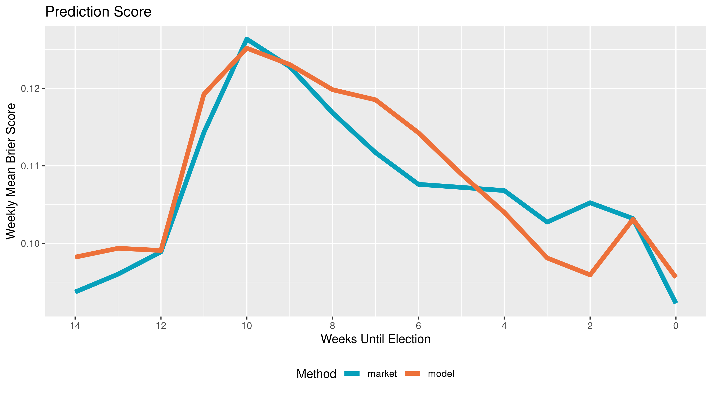

```{r setup, include=FALSE}
knitr::opts_chunk$set(
  eval = TRUE,
  echo = FALSE,
  warning = FALSE,
  message = FALSE,
  error = FALSE,
  collapse = TRUE,
  comment = "#>",
  fig.width = 10,
  dpi = 300
)
if (!interactive()) {
  options(width = 99)
  set.seed(5)
}
```

Election prediction helps party officials, campaign operatives, and journalists
interpret campaigns in a quantitative manner. Uncertainty is key to a useful
election prediction.

The forecast model has become a staple of political punditry. Popularized by the
data journalist at [FiveThirtyEight][538], the forecasting model is a
statistical tool used to incorporate a number of quantitative inputs and produce
a _probabilistic_ view of all possible outcomes.

Prediction markets can be used to generate similarly probabilistic views of
election outcomes by utilizing the economic forces of price discovery and risk
aversion to overcome the ideological bias of self-interested traders on a binary
options exchange.

**Can markets predict elections better than the models?** I propose a null
hypothesis of no difference in the mean [Brier score][bs] of forecasting models
and prediction markets for competitive races in the 2018 U.S. Congressional
midterm elections.

## Reproduce

All public input data has been saved on the [internet archive][ia] and can be
accessed through their wayback machine.

Data manipulation is done using the R language and packages from the
[`tidyverse`][tv] ecosystem.

The R scripts in the [`/code`](/code) directory can be run in sequential order
to reproduce the results. There are four scripts to perform four steps:

1. Read archived data with `wayback` and `readr`
2. Wrangle and format with `dplyr` and `tidyr`
3. Evaluate predictions with `stats` and `verification`
4. Communicate results with `ggplot2` and `rmarkdown`

## Data

```{r library}
library(readr)
library(knitr)
library(purrr)
library(dplyr)
library(tidyr)
library(pander)
library(fs)
```

### Forecasting Models

I will be using the FiveThirtyEight "classic" model to represent the best
capabilities of statistical election forecasting. FiveThirtyEight has a track
record of accuracy over the last decade.

As [Nate Silver explains][mw18], most forecasting models (1) "take lots of
polls, perform various types of adjustments to them, and then blend them with
other kinds of empirically useful indicators to forecast each race".
Importantly, they (2) "account for the uncertainty in the forecast and simulate
the election thousands of times" to generate a probabilistic forecast.

The classic model incorporates three types of inputs, primarily direct and
imputed polling as well as fundamentals factors like incumbency and the generic
ballot.

FiveThirtyEight publishes two files with top-level daily predictions:

1. [`senate_seat_forecast.csv`][sf]
2. [`house_district_forecast.csv`][hf]

```{r model_read}
congress_base_forecast <- 
  dir_ls("data/raw/models/") %>% 
  map_df(readr::read_csv) %>% 
  filter(model == "classic")

races <- congress_base_forecast %>% 
  unite(state, district, class,col = race) %>% 
  pull(race)
```

Together, there are `r scales::comma(nrow(congress_base_forecast))` daily
"classic" model prediction from `r n_distinct(races)` races with 
`r ncol(congress_base_forecast)` variables.

### Prediction Markets

Prediction markets generate probabilistic forecasts by crowd-sourcing the
collection of data from self-interested and risk averse traders. 
[The efficient market hypothesis][efm] holds that asset prices reflect _all_ 
available information (including forecasting models).

[PredictIt][pi] is an exchange run by [Victoria University][nz] of Wellington,
New Zealand. The site offers a continuous double-auction exchange, where traders
buy and sell shares of futures contracts tied to election outcomes. As a
trader's perception of probabilities changes, they can sell those shares. The
market equilibrium price updates accordingly to reflect current probability. As
outcomes become more likely, prices rise as demand for shares increases.

```{r market_read}
DailyMarketData <- read_delim(
  file = "data/raw/markets/DailyMarketData.csv",
  delim = "|",
  na = "n/a",
  col_types = cols(
    MarketId = col_character(),
    ContractName = col_character(),
    ContractSymbol = col_character(),
    Date = col_date()
  )
)
```

PredictIt provided the price history in [`DailyMarketData.csv`][dmd]. Together, 
there are `r scales::comma(nrow(DailyMarketData))` daily market prices from 
`r n_distinct(DailyMarketData$MarketId)` races with  `r ncol(DailyMarketData)` 
variables.

## Compare

The FiveThirtyEight model and PredictIt markets data sets were joined using the
date and a unique race code. The data was then pivoted to a long format,
which allows us to compare each method against the ultimate binary results of
the race.

```{r read_compare}
compare <- read_csv(here::here("data/new/compare.csv"))
```

```{r view_compare}
kable(
  x = head(compare, 10),
  format = "markdown",
  digits = 3,
  align = "lllrcccr",
  col.names = c(
    "Date",
    "Race",
    "Method",
    "Probability",
    "Democrat?",
    "Wins?",
    "Correct?",
    "Brier score"
  )
)
```

Here we can see how each each race was predicted by each method, highlighted by
the race results.

```{r plot_cartesian}

```

A probabilistic prediction should find that events with a 60% probability occur
60% of the time. Here we see how many of each method's predictions occurred that
frequently. Predictions with a 60% probability that occurred 85% of the time are
underconfident and vice versa.

```{r plot_calibration}
include_graphics("plots/plot_calibration.png")
```

[The Brier score][bs] allows for probabilistic forecasts to be meaningfully
tested with mean squared error. The Brier score rewards skillful predictions,
with a 100% probability earning a score of zero if correct. Using this test,
there is no statistically significant difference in the respective skill scores
of each predictive method.

```{r run_test}
pander(t.test(brier ~ method, data = compare))
```

```{r plot_brier}

```

[538]: https://fivethirtyeight.com/
[ia]: https://archive.org/
[tv]: https://github.com/tidyverse/
[mw14]: https://fivethirtyeight.com/features/how-the-fivethirtyeight-senate-forecast-model-works/
[mw18]: https://fivethirtyeight.com/methodology/how-fivethirtyeights-house-and-senate-models-work/
[pr]: https://projects.fivethirtyeight.com/pollster-ratings/
[mc]: https://en.wikipedia.org/wiki/Monte_Carlo_method
[sf]: https://projects.fivethirtyeight.com/congress-model-2018/senate_seat_forecast.csv
[hf]: https://projects.fivethirtyeight.com/congress-model-2018/house_district_forecast.csv
[efm]: https://en.wikipedia.org/wiki/Efficient-market_hypothesis
[pi]: https://www.predictit.org/
[nz]: https://www.victoria.ac.nz/
[td]: http://vita.had.co.nz/papers/tidy-data.html
[bs]: https://en.wikipedia.org/wiki/Brier_score
[dmd]: data/raw/DailyMarketData.csv
