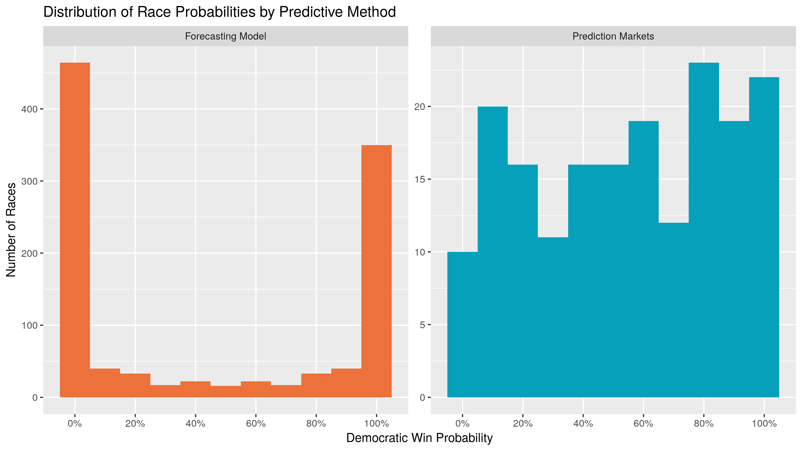
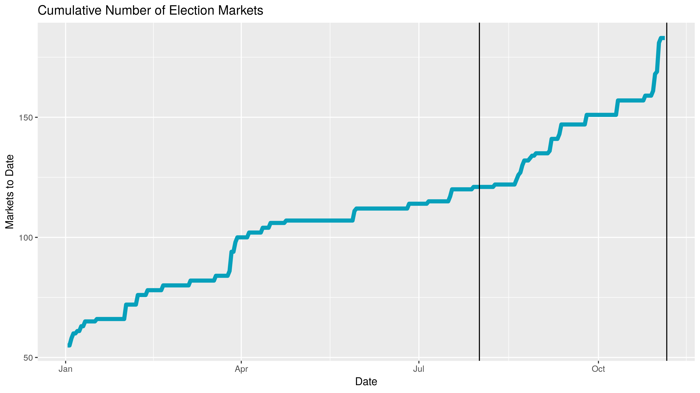
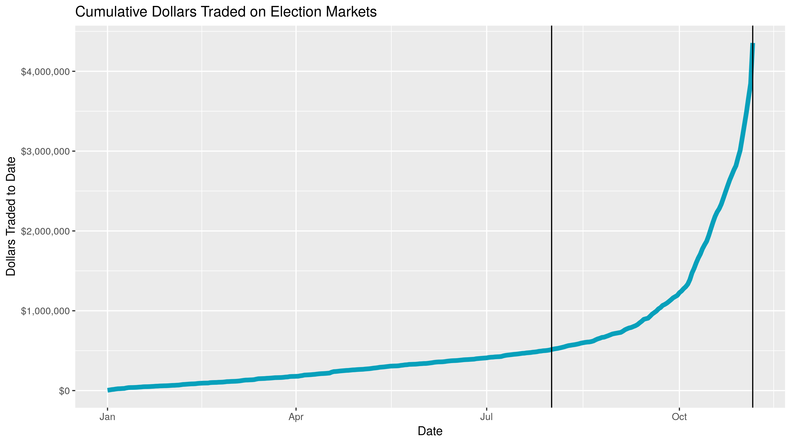

```{r setup, include=FALSE}
library(tidyverse)
library(knitr)
opts_chunk$set(
  warning = FALSE,
  message = FALSE,
  error   = FALSE,
  echo    = FALSE
)
```

```{r read}
source("./code/01_read_inputs.R")
```

```{r format}
source("./code/02_format_inputs.R")
```

```{r compare}
source("./code/03_compare_methods.R")
```

```{r plot}
source("./code/04_explore_viz.R")
```

The forecast model has become a staple of political punditry. Popularized by the
data journalism site [FiveThirtyEight][01], the forecast model is a statistical
tool used to incorporate a number of quantitative inputs and output a
_probabilistic_ view of all possible outcomes.

Markets can be used as alternative method of generating similarly probabilistic
views of outcomes. Markets utilize the economic forces of price discovery and
risk aversion to overcome the implicit bias of self-interested traders on a
binary options exchange.

How do these two predictive methods fare in their ability to prediction
elections? I propose a null hypothesis of no difference between the proportion
of accurate predictions made by forecasting models and prediction markets in the
2018 congressional midterm elections.

For model data, I will be using the public data from the proprietary model
written by the journalists at FiveThirtyEight. For market data, I will be
working with Victoria University of Wellington, New Zealand to analyze data from
their PredictIt exchange.

## Forecasting Models

As Nate Silver, FiveThirtyEight's founder and the primary author of their model,
explains in their [methedological article][08]:

> (Forecasting models) take lots of polls, perform various types of adjustments
to them, and then blend them with other kinds of empirically useful indicators
(what we sometimes call “the fundamentals”) to forecast each race. Then they
account for the uncertainty in the forecast and simulate the election thousands
of times.

I will be using the FiveThirtyEight model data to represent the best
capabilities of statistical election forecasting. FiveThirtyEight has a track
record of accuracy over the last decade, including the 2016 Presidential
election, where they gave President Trump a 30% chance of winning (compared to 1%
from some competitors). Furthermore, they make the top-line output of their
model free to the public.

The goal of these mathematical forecasting models, [according to Silver][21], is
"not to divine some magic formula that miraculously predicts every election.
Instead, it’s to make sense of publicly available information in a rigorous and
disciplined way."

### Model Inputs

FiveThirtyEight's 2018 House and Senate models incorporate four types of
quantitative data:

1. **Polling:** District level polling. [FiveThirtyEight rates pollsters][09] to
adjust their findings. The results are further adjusted three times:
    1. The likely voter adjustment ensures a more accurate sampling frame.
    1. The conservative timeline adjustment to favor recency.
    1. The house effects adjustment corrects for persistent statistical biases.
1. **CANTOR:** A proprietary k-nearest neighbors algorithm to identify similar
congressional districts (based on demographic, geographic and political factors)
to infers results for polling-sparce districts.
1. **Fundamentals:** Non-polling factors that historically help in predicting
congressional races:
    * Incumbency
    * Partisanship
    * Previous margin
    * Generic ballot
    * Fundraising
    * Incumbent voting
    * Challenger experience
    * [Scandals][20]
1. **Expert forecasts:** Ratings published by the historically accurate experts 
at the [Cook Political Report][22], [Inside Elections][23], and 
[Sabato’s Crystal Ball][24].

FiveThirtyEight uses these inputs to generate three models. The "Lite" model
only uses polling and CANTOR; "Classic" adds in the fundamental data; and
"Deluxe" further incorporates the less quantitative expert forecasts.

In [describing][26] the process of their 2014 Senate Model, Silver described the
general process by which the above inputs are incorporated in producing a
probabilistic output:

> Most election models (including [FiveThirtyEight's]) work in something like
the following way: First, they calculate the most likely outcome in a particular
state (“The Republican wins by 1 point”) and then they determine the degree of
uncertainty around that estimate. Most models do this by means of a normal
distribution or something similar to it.

In an analysis of past elections, it has been proven that the degree of
uncertainty is _greater_ when:

1. The election is further away
1. There are fewer polls
1. The polls disagree more with one another
1. The polling average disagrees more with the state fundamentals
1. There are more undecideds or third-party voters in the polls
1. The race is more lopsided

With these quantitative factors in mind, the model calculates the probability
distribution in each candidate's share of the vote.

The model then runs uses these predicted shares to run a Monte Carlo simulation.
In each iteration of the simulation, a share of the vote for each candidate in a
race is drawn from the above probability distributions. A winner is determined
and the simulation runs again. The percentage of simulated elections won is
analogous to the probability of victory on election day.

### Model Output

```{r model_stats}
model_combined <- senate_seat_forecast %>% 
  rename("district" = "class") %>% 
  bind_rows(house_district_forecast)

avg_daily <- model_combined %>% 
  group_by(forecastdate) %>% 
  summarise(n = n()) %>% 
  select(n) %>% 
  as_vector() %>% 
  mean() %>% 
  round()
```

The team at FiveThirtyEight makes public a portion of their model's output as
four separate `.csv` files on their website:

1. [`/congress-model-2018/senate_national_forecast.csv`][11]
1. [`/congress-model-2018/house_national_forecast.csv`][13]
1. [`/congress-model-2018/senate_seat_forecast.csv`][12]
1. [`/congress-model-2018/house_district_forecast.csv`][14]

The two national forecasts provide the FiveThirtyEight calculations for each
party's probability of winning a majority in their respective chambers on any
given day (e.g., "Today, he Democratic party has an 85% chance of winning
control of the House of Representatives with a simple majority of seats").

The Senate seat and House district level forecasts will be used in this project.
Each observation represents one day's probability of victory for one candidate.
There are `r nrow(model_seat)` observations in the Senate seat level file and 
`r nrow(model_district)` for the House district level. Both data sets can be
easily combined; together, there are an average of `r avg_daily` unique daily
predictions from `r min(model_combined$forecastdate)` to
`r max(model_combined$forecastdate)`.

For each observation, there are `r length(model_combined)` variables recorded:

1. Date
1. State
1. District or Senate class
1. Election type (regular or special)
1. Candidate
1. Political party
1. Model version
1. **Probability of victory**
1. Expected share of the vote
1. Minimum share of the vote
1. Maximum share of the vote

Below is a random sample of observations from the combined House district and
Senate seat congressional model data sets.

```{r model_data, echo=FALSE, message=FALSE}
model_combined %>% 
  select(-special, -p10_voteshare, -p90_voteshare) %>% 
  sample_n(5) %>%
  arrange(forecastdate) %>% 
  kable(format = "markdown",
        digits = 3,
        col.names = c("Date", 
                      "State", 
                      "District",
                      "Candidate",
                      "Party",
                      "Incumbent",
                      "Model",
                      "Probability", 
                      "Vote Share"),
        caption = "299,760 observations of 7 variables")
```

## Prediction Markets

As summarized [on Wikipedia][18]:

> Prediction markets are exchange-traded markets created for the purpose of
trading the outcome of events. The market prices can indicate what the crowd
thinks the probability of the event is. A prediction market contract trades
between 0 and 100%… The main purposes of prediction markets are eliciting
aggregating beliefs over an unknown future outcome. Traders with different
beliefs trade on contracts whose payoffs are related to the unknown future
outcome and the market prices of the contracts are considered as the aggregated
belief.

I will be using the market history of the PredictIt exchange run by Victoria
University of Wellington, New Zealand. PredictIt is one of the few prediction
markets permitted to operate domestically due to the academic value of the
markets. PredictIt partners with academic researchers to provide market history
free of charge.

### Market Inputs

The fundamental input to a prediction market is a bet between two traders. These
bets are made in the form of binary futures contracts that execute for a fixed
price based on the outcome of some future event. Contracts tied to a correct
prediction pay out, paid for by the incorrect contract. PredictIt runs a
continuous double-auction exchange where traders buy and sell shares of futures
contracts.

Traders on PredictIt place bets using real money, ensuring the proper incentives
for traders to overcome bias and make bets in line with their individual
estimates of probability and their level of risk aversion. The greater the
volume of money traded on a market, the better forces of price discovery can
determine equilibrium. Betting on elections is illegal, but PredictIt and a
handful of other markets are allowed to operate under a letter of No-Action by
the Commodity Futures Trading Commission. The CFTC did cap the maximum bet to
$850, potentially hindering true price discovery.

### Market Output

Each Congressional race is predicted with it's own market, where traders buy and
sell shares of the opposing outcomes. Instead of producing a single prediction
every day, the market equilibrium price is continually adjusting to take into
account the views of the traders. The history of this price is provided to
researchers. As [PredictIt outlines][16] in their data agreement:

> In order to take full advantage of the research opportunities presented by
prediction markets like PredictIt, we make our data available to members of the
academic community at no cost. PredictIt’s market data offers researchers a
wealth of information that can be used to further our understanding of a wide
array of subjects in fields of study as diverse as microeconomics, political
behavior, computer science and game theory.

I scraped [the PredictIt API][17] before the election and used the data to find
all market ID's related to 2018 Congressional elections. PredictIt then provided
the relevant market data as a single `.csv` file.

Each observation represents one day's opening, closing, low, and high price for
a single contract from a single market. There are 44,711 observations covering
145 contracts across 118 markets. For each observation there are 11 variables:

1. Market ID
1. Market name
1. Market symbol
1. Contract name
1. Contract symbol
1. Prediction date
1. Opening contract price
1. Low contract price
1. High contract price
1. **Closing contract price**
1. Volume of shares traded

Below is a random sample of observations from the PredictIt trading markets.

```{r market_data, echo=FALSE, message=FALSE}
DailyMarketData %>% 
  select(-MarketName, 
         -ContractName) %>% 
  sample_n(5) %>%
  arrange(Date) %>% 
  kable(format = "markdown",
        digits = 3,
        col.names = c("ID", 
                      "Market",
                      "Contract",
                      "Date",
                      "Open",
                      "Low",
                      "High",
                      "Close",
                      "Volume"),
        caption = "44,711 observations of 6 variables")
```

## Data Wrangling

The above data sets were both formatted to contain two key variables: `date` and
`race`. Together, these variables create a relational key that can be used to
join the two data sets for comparison.

For model data, the new `race` variable is created by combining the old `state` and
`district` variables. For market data, the new `race` code is extracted from the
old `MarketSymbol`.

Observations can then be gathered to make the single combined data frame
[tidy][19], with each observation representing _one_ prediction (on one date, for
one party, from one predictive method).

Redundant complimentary predictions are removed by selecting only democratic
party probabilities. For markets comprised of yes/no contracts on a single
Republican incumbent's re-election probability, the price can be inverted.

Below is the data frame of historical predictions along with the election
results. There are `r nrow(tidy)` observations of `r length(tidy)` variables:

1. Prediction Date
1. Race Code
1. Predictive Method
1. Democratic candidate's probability of winning

```{r tidy_joined, echo=TRUE, eval=FALSE}
inner_join(x    = markets2, 
           y    = model2, 
           by   = c("date", "race")) %>%
  filter(date   > "2018-07-31",
         date   < "2018-11-06") %>%
  rename(model  = prob,
         market = close) %>% 
  gather(key    = method,
         value  = prob,
         model, market) %>%
  arrange(date, race, method)
```

```{r tidy_data, echo=FALSE, message=FALSE}
tidy %>%
  slice(1:10) %>% 
  kable(format = "markdown",
        digits = 4,
        col.names = c("Date", 
                      "Race",
                      "Predictive Method",
                      "Dem Probability"),
        caption = "29,400 observations of 7 variables")
```

## Data Exploration









[01]: https://fivethirtyeight.com/
[02]: https://projects.fivethirtyeight.com/2016-election-forecast/
[03]: https://www.nytimes.com/interactive/2016/upshot/presidential-polls-forecast.html
[04]: http://elections.huffingtonpost.com/2016/forecast/president
[05]: https://en.wikipedia.org/wiki/Sampling_(statistics)
[06]: https://www.realclearpolitics.com/
[07]: https://en.wikipedia.org/wiki/Law_of_large_numbers
[08]: https://fivethirtyeight.com/methodology/how-fivethirtyeights-house-and-senate-models-work/
[09]: https://projects.fivethirtyeight.com/pollster-ratings/
[10]: https://en.wikipedia.org/wiki/Monte_Carlo_method
[11]: https://projects.fivethirtyeight.com/congress-model-2018/senate_national_forecast.csv
[12]: https://projects.fivethirtyeight.com/congress-model-2018/senate_seat_forecast.csv
[13]: https://projects.fivethirtyeight.com/congress-model-2018/house_national_forecast.csv
[14]: https://projects.fivethirtyeight.com/congress-model-2018/house_district_forecast.csv
[15]: https://www.predictit.org/support/faq
[16]: https://www.predictit.org/research
[17]: https://www.predictit.org/api/marketdata/all/
[18]: https://en.wikipedia.org/wiki/Prediction_market
[19]: http://vita.had.co.nz/papers/tidy-data.html
[20]: https://docs.google.com/spreadsheets/d/1ksBLxRR3GCZd33IvhkcNqqBd5K8HwlWC7YuAkVmS1lg/ 
[21]: https://fivethirtyeight.com/features/how-the-fivethirtyeight-senate-forecast-model-works/
[22]: https://cookpolitical.com/
[23]: https://insideelections.com/
[24]: http://www.centerforpolitics.org/crystalball/
[25]: https://github.com/unitedstates/congress-legislators
[26]: http://53eig.ht/1u2pSbD
