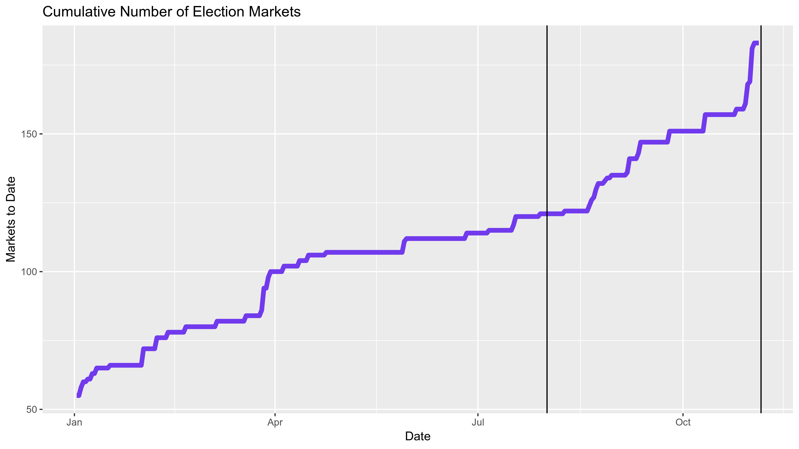
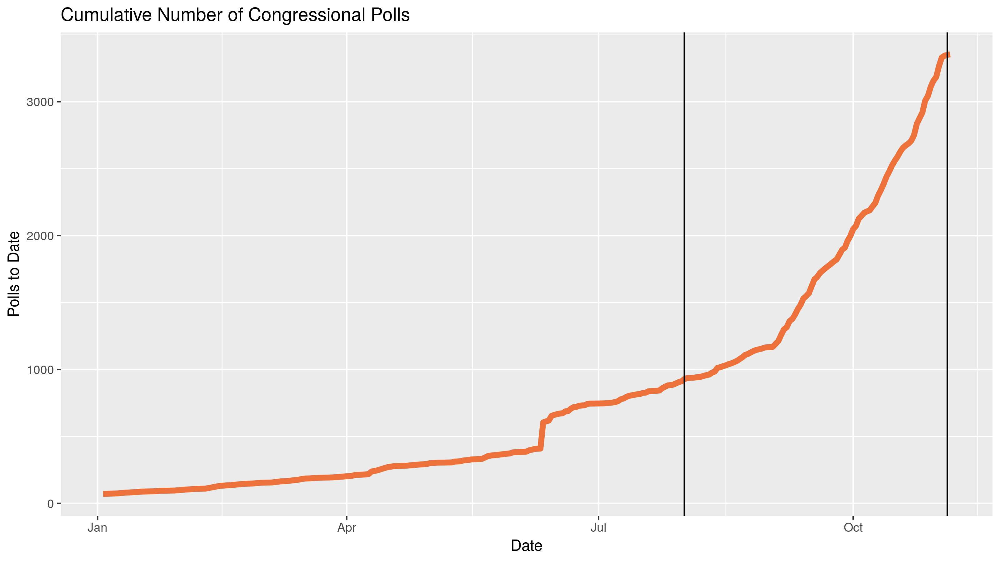
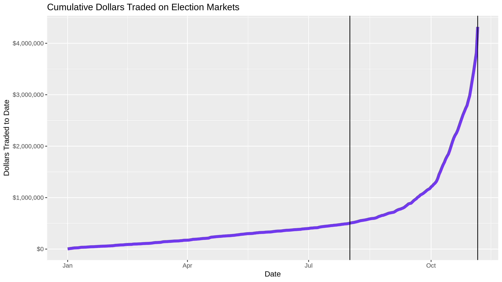

-   [Forecasting Models](#forecasting-models)
    -   [Model Inputs](#model-inputs)
    -   [Model Output](#model-output)
-   [Prediction Markets](#prediction-markets)
    -   [Market Inputs](#market-inputs)
    -   [Market Output](#market-output)
-   [Data Wrangling](#data-wrangling)
-   [Data Exploration](#data-exploration)

The forecast model has become a staple of political punditry.
Popularized by the data journalism site
[FiveThirtyEight](https://fivethirtyeight.com/), the forecast model is a
statistical tool used to incorporate a number of quantitative inputs and
output a *probabilistic* view of all possible outcomes.

Markets can be used as alternative method of generating similarly
probabilistic views of outcomes. Markets utilize the economic forces of
price discovery and risk aversion to overcome the implicit bias of
self-interested traders on a binary options exchange.

How do these two predictive methods fare in their ability to prediction
elections? I propose a null hypothesis of no difference between the
proportion of accurate predictions made by forecasting models and
prediction markets in the 2018 congressional midterm elections.

For model data, I will be using the public data from the proprietary
model written by the journalists at FiveThirtyEight. For market data, I
will be working with Victoria University of Wellington, New Zealand to
analyze data from their PredictIt exchange.

Forecasting Models
------------------

As Nate Silver, FiveThirtyEight’s founder and the primary author of
their model, explains in their [methedological
article](https://fivethirtyeight.com/methodology/how-fivethirtyeights-house-and-senate-models-work/):

> (Forecasting models) take lots of polls, perform various types of
> adjustments to them, and then blend them with other kinds of
> empirically useful indicators (what we sometimes call “the
> fundamentals”) to forecast each race. Then they account for the
> uncertainty in the forecast and simulate the election thousands of
> times.

I will be using the FiveThirtyEight model data to represent the best
capabilities of statistical election forecasting. FiveThirtyEight has a
track record of accuracy over the last decade, including the 2016
Presidential election, where they gave President Trump a 30% chance of
winning (compard to 1% from some competitors). Furthermore, they make
the top-line output of their model free to the public.

The goal of these mathematical forecasting models, [according to
Silver](https://fivethirtyeight.com/features/how-the-fivethirtyeight-senate-forecast-model-works/),
is “not to divine some magic formula that miraculously predicts every
election. Instead, it’s to make sense of publicly available information
in a rigorous and disciplined way.”

### Model Inputs

FiveThirtyEight’s 2018 House and Senate models incorporate four types of
quantitative data:

1.  **Polling:** District level polling. [FiveThirtyEight rates
    pollsters](https://projects.fivethirtyeight.com/pollster-ratings/)
    to adjust their findings. The results are further adjusted three
    times:
    1.  The likely voter adjustment ensures a more accurate sampling
        frame.
    2.  The conservative timeline adjustment to favor recency.
    3.  The house effects adjustment corrects for persistent statistical
        biases.
2.  **CANTOR:** A proprietary k-nearest neighbors algorithm to identify
    similar congressional districts (based on demographic, geographic
    and political factors) to infers results for polling-sparce
    districts.
3.  **Fundamentals:** Non-polling factors that historically help in
    predicting congressional races:
    -   Incumbency
    -   Partisanship
    -   Previous margin
    -   Generic ballot
    -   Fundraising
    -   Incumbent voting
    -   Challenger experience
    -   [Scandals](https://docs.google.com/spreadsheets/d/1ksBLxRR3GCZd33IvhkcNqqBd5K8HwlWC7YuAkVmS1lg/edit?usp=sharing)
4.  **Expert forecasts:** Ratings published by the historically accurate
    experts at the [Cook Political Report](https://cookpolitical.com/),
    [Inside Elections](https://insideelections.com/), and [Sabato’s
    Crystal Ball](http://www.centerforpolitics.org/crystalball/).

FiveThirtyEight uses these inputs to generate three models. The “Lite”
model only uses polling and CANTOR; “Classic” adds in the fundamental
data; and “Deluxe” further incorporates the less quantitative expert
forecasts.

In [describing](http://53eig.ht/1u2pSbD) the process of their 2014
Senate Model, Silver described the general process by which the above
inputs are incorporated in producing a probabilistic output:

> Most election models (including \[FiveThirtyEight’s\]) work in
> something like the following way: First, they calculate the most
> likely outcome in a particular state (“The Republican wins by 1
> point”) and then they determine the degree of uncertainty around that
> estimate. Most models do this by means of a normal distribution or
> something similar to it.

In an analysis of past elections, it has been proven that the degree of
uncertainty is *greater* when:

1.  The election is further away
2.  There are fewer polls
3.  The polls disagree more with one another
4.  The polling average disagrees more with the state fundamentals
5.  There are more undecideds or third-party voters in the polls
6.  The race is more lopsided

With these quantitative factors in mind, the model calculates the
probability distribution in each candidate’s share of the vote.

The model then runs uses these predicted shares to run a Monte Carlo
simulation. In each iteration of the simulation, a share of the vote for
each candidate in a race is drawn from the above probability
distributions. A winner is determined and the simulation runs again. The
percentage of simulated elections won is analogous to the probability of
victory on election day.

### Model Output

The team at FiveThirtyEight makes public a portion of their model’s
output as four separate `.csv` files on their website:

1.  [`/congress-model-2018/senate_national_forecast.csv`](https://projects.fivethirtyeight.com/congress-model-2018/senate_national_forecast.csv)
2.  [`/congress-model-2018/house_national_forecast.csv`](https://projects.fivethirtyeight.com/congress-model-2018/house_national_forecast.csv)
3.  [`/congress-model-2018/senate_seat_forecast.csv`](https://projects.fivethirtyeight.com/congress-model-2018/senate_seat_forecast.csv)
4.  [`/congress-model-2018/house_district_forecast.csv`](https://projects.fivethirtyeight.com/congress-model-2018/house_district_forecast.csv)

The two national forecasts provide the FiveThirtyEight calculations for
each party’s probability of winning a majority in their respective
chambers on any given day (e.g., “Today, he Democratic party has an 85%
chance of winning control of the House of Representatives with a simple
majority of seats”).

The Senate seat and House district level forecasts will be used in this
project. Each observation represents one day’s probability of victory
for one candidate. There are 28353 observations in the Senate seat level
file and 299760 for the House district level. Both data sets can be
easily combined; together, there are an average of 3348 unique daily
predictions from 2018-08-01 to 2018-11-06.

For each observation, there are 12 variables recorded:

1.  Date
2.  State
3.  District or Senate class
4.  Election type (regular or special)
5.  Candidate
6.  Political party
7.  Model version
8.  **Probability of victory**
9.  Expected share of the vote
10. Minimum share of the vote
11. Maximum share of the vote

Below is a random sample of observations from the combined House
district and Senate seat congressional model data sets.

<table>
<thead>
<tr class="header">
<th style="text-align: left;">Date</th>
<th style="text-align: left;">State</th>
<th style="text-align: right;">District</th>
<th style="text-align: left;">Candidate</th>
<th style="text-align: left;">Party</th>
<th style="text-align: left;">Incumbent</th>
<th style="text-align: left;">Model</th>
<th style="text-align: right;">Probability</th>
<th style="text-align: right;">Vote Share</th>
</tr>
</thead>
<tbody>
<tr class="odd">
<td style="text-align: left;">2018-08-14</td>
<td style="text-align: left;">PA</td>
<td style="text-align: right;">8</td>
<td style="text-align: left;">John Chrin</td>
<td style="text-align: left;">R</td>
<td style="text-align: left;">FALSE</td>
<td style="text-align: left;">classic</td>
<td style="text-align: right;">0.131</td>
<td style="text-align: right;">45.43</td>
</tr>
<tr class="even">
<td style="text-align: left;">2018-08-20</td>
<td style="text-align: left;">MD</td>
<td style="text-align: right;">7</td>
<td style="text-align: left;">David Griggs</td>
<td style="text-align: left;">LIB</td>
<td style="text-align: left;">FALSE</td>
<td style="text-align: left;">classic</td>
<td style="text-align: right;">0.000</td>
<td style="text-align: right;">3.45</td>
</tr>
<tr class="odd">
<td style="text-align: left;">2018-09-05</td>
<td style="text-align: left;">MT</td>
<td style="text-align: right;">1</td>
<td style="text-align: left;">Matt Rosendale</td>
<td style="text-align: left;">R</td>
<td style="text-align: left;">FALSE</td>
<td style="text-align: left;">classic</td>
<td style="text-align: right;">0.112</td>
<td style="text-align: right;">44.10</td>
</tr>
<tr class="even">
<td style="text-align: left;">2018-09-29</td>
<td style="text-align: left;">CA</td>
<td style="text-align: right;">37</td>
<td style="text-align: left;">Karen Bass</td>
<td style="text-align: left;">D</td>
<td style="text-align: left;">TRUE</td>
<td style="text-align: left;">lite</td>
<td style="text-align: right;">1.000</td>
<td style="text-align: right;">90.16</td>
</tr>
<tr class="odd">
<td style="text-align: left;">2018-11-02</td>
<td style="text-align: left;">KS</td>
<td style="text-align: right;">1</td>
<td style="text-align: left;">Alan LaPolice</td>
<td style="text-align: left;">D</td>
<td style="text-align: left;">FALSE</td>
<td style="text-align: left;">lite</td>
<td style="text-align: right;">0.011</td>
<td style="text-align: right;">40.08</td>
</tr>
</tbody>
</table>

Prediction Markets
------------------

As summarized [on
Wikipedia](https://en.wikipedia.org/wiki/Prediction_market):

> Prediction markets (also known as predictive markets, information
> markets, decision markets, idea futures, event derivatives, or virtual
> markets) are exchange-traded markets created for the purpose of
> trading the outcome of events. The market prices can indicate what the
> crowd thinks the probability of the event is. A prediction market
> contract trades between 0 and 100%… The main purposes of prediction
> markets are eliciting aggregating beliefs over an unknown future
> outcome. Traders with different beliefs trade on contracts whose
> payoffs are related to the unknown future outcome and the market
> prices of the contracts are considered as the aggregated belief.

### Market Inputs

*icomplete*

By utilizing the economic forces of risk aversion and self-interest,
prediction markets aim to overcome the implicit biases of the traders.
Traders continually buy and sell contracts that pay out at $1 based on
the outcome of the election.

If a trader believes a candidate has a 75% chance of winning an
election, the economics dictate he should be willing to buy a given
number of contracts at a price less than $0.75 each. Should events
unfold to increase or decrease this probability, the trader can sell
these shares for more or less than he originally paid; this updates the
market equilibrium price to reflect current probabilities.

### Market Output

Each Congressional race is predicted with it’s own market where traders
buy and sell shares of the opposing outcomes. Instead of producing a
single prediction every day, the market equilibrium price is continually
adjusting to take into account the views of the traders. The history of
this price is provided to researchers. As [PredictIt
outlines](https://www.predictit.org/research) in their data agreement:

> In order to take full advantage of the research opportunities
> presented by prediction markets like PredictIt, we make our data
> available to members of the academic community at no cost. PredictIt’s
> market data offers researchers a wealth of information that can be
> used to further our understanding of a wide array of subjects in
> fields of study as diverse as microeconomics, political behavior,
> computer science and game theory.

I scraped [the PredictIt
API](https://www.predictit.org/api/marketdata/all/) before the election
and used the data to find all market ID’s related to 2018 Congressional
elections. PredictIt then provided the relevant market data as a single
`.csv` file.

Each observation represents one day’s opening, closing, low, and high
price for a single contract from a single market. There are 44,711
observations covering 145 contracts across 118 markets. For each
observation there are 11 variables:

1.  Market ID
2.  Market name
3.  Market symbol
4.  Contract name
5.  Contract symbol
6.  Prediction date
7.  Opening contract price
8.  Low contract price
9.  High contract price
10. **Closing contract price**
11. Volume of shares traded

Below is a random sample of observations from the PredictIt trading
markets.

<table>
<thead>
<tr class="header">
<th style="text-align: left;">ID</th>
<th style="text-align: left;">Market</th>
<th style="text-align: left;">Contract</th>
<th style="text-align: left;">Date</th>
<th style="text-align: right;">Open</th>
<th style="text-align: right;">Low</th>
<th style="text-align: right;">High</th>
<th style="text-align: right;">Close</th>
<th style="text-align: right;">Volume</th>
</tr>
</thead>
<tbody>
<tr class="odd">
<td style="text-align: left;">2999</td>
<td style="text-align: left;">NELSON.FLSENATE.2018</td>
<td style="text-align: left;">NA</td>
<td style="text-align: left;">2017-06-11</td>
<td style="text-align: right;">0.75</td>
<td style="text-align: right;">0.75</td>
<td style="text-align: right;">0.75</td>
<td style="text-align: right;">0.75</td>
<td style="text-align: right;">0</td>
</tr>
<tr class="even">
<td style="text-align: left;">3883</td>
<td style="text-align: left;">TX29.2018</td>
<td style="text-align: left;">DEM.TX29.2018</td>
<td style="text-align: left;">2018-04-03</td>
<td style="text-align: right;">0.95</td>
<td style="text-align: right;">0.95</td>
<td style="text-align: right;">0.97</td>
<td style="text-align: right;">0.97</td>
<td style="text-align: right;">1</td>
</tr>
<tr class="odd">
<td style="text-align: left;">4231</td>
<td style="text-align: left;">FISC.NESENATE.2018</td>
<td style="text-align: left;">NA</td>
<td style="text-align: left;">2018-06-13</td>
<td style="text-align: right;">0.94</td>
<td style="text-align: right;">0.94</td>
<td style="text-align: right;">0.94</td>
<td style="text-align: right;">0.94</td>
<td style="text-align: right;">0</td>
</tr>
<tr class="even">
<td style="text-align: left;">3737</td>
<td style="text-align: left;">WA08.2018</td>
<td style="text-align: left;">DEM.WA08.2018</td>
<td style="text-align: left;">2018-08-31</td>
<td style="text-align: right;">0.61</td>
<td style="text-align: right;">0.55</td>
<td style="text-align: right;">0.61</td>
<td style="text-align: right;">0.55</td>
<td style="text-align: right;">16</td>
</tr>
<tr class="odd">
<td style="text-align: left;">4271</td>
<td style="text-align: left;">PA17.2018</td>
<td style="text-align: left;">DEM.PA17.2018</td>
<td style="text-align: left;">2018-09-01</td>
<td style="text-align: right;">0.93</td>
<td style="text-align: right;">0.93</td>
<td style="text-align: right;">0.93</td>
<td style="text-align: right;">0.93</td>
<td style="text-align: right;">0</td>
</tr>
</tbody>
</table>

Data Wrangling
--------------

The above data sets were both formatted to contain three keys variables:
`date`, `race`, and `party`. Together, these three variables create a
relational key that can be used to join the two data sets for
comparison.

For model data, the new `race` variable is created by combining the old
`state` and `district` variables. For market data, the new `race` code
is extracted from the old `MarketSymbol`.

For market data, House race party variables are extracted from the
`ContractSymbol` character string. Senate race party variables are
obtained using the incumbent’s name in the `MarketSymbol` character
string and the
[`/congress-legislators`](https://github.com/unitedstates/congress-legislators)
data set maintained by the @unitedstates project.

Observations can then be gathered to make the single combined data frame
[tidy](http://vita.had.co.nz/papers/tidy-data.html), with each
observation representing one prediction (on one date, for one party,
with one predictive method).

Redundant complimentary predictions are removed by selecting only
democratic party probabilities. Some markets are comprised of yes/no
contracts for a single Republican incumbent’s re-election probability;
for such markets, the price (probability) can be simply inverted.

Below is the data frame of historical predictions along with the
election results. There are 17306 observations of 4 variables:

1.  Prediction Date
2.  Race Code
3.  Predictive Method
4.  Democratic candidate’s probability of winning

<table>
<thead>
<tr class="header">
<th style="text-align: left;">Date</th>
<th style="text-align: left;">Race</th>
<th style="text-align: left;">Predictive Method</th>
<th style="text-align: right;">Prob. of Dem. Victory</th>
</tr>
</thead>
<tbody>
<tr class="odd">
<td style="text-align: left;">2018-08-21</td>
<td style="text-align: left;">NJ-11</td>
<td style="text-align: left;">model</td>
<td style="text-align: right;">0.7071</td>
</tr>
<tr class="even">
<td style="text-align: left;">2018-08-23</td>
<td style="text-align: left;">IL-13</td>
<td style="text-align: left;">market</td>
<td style="text-align: right;">0.2400</td>
</tr>
<tr class="odd">
<td style="text-align: left;">2018-08-25</td>
<td style="text-align: left;">TX-21</td>
<td style="text-align: left;">model</td>
<td style="text-align: right;">0.1322</td>
</tr>
<tr class="even">
<td style="text-align: left;">2018-09-29</td>
<td style="text-align: left;">CA-10</td>
<td style="text-align: left;">market</td>
<td style="text-align: right;">0.6100</td>
</tr>
<tr class="odd">
<td style="text-align: left;">2018-10-18</td>
<td style="text-align: left;">IL-13</td>
<td style="text-align: left;">model</td>
<td style="text-align: right;">0.2951</td>
</tr>
</tbody>
</table>

Data Exploration
----------------

