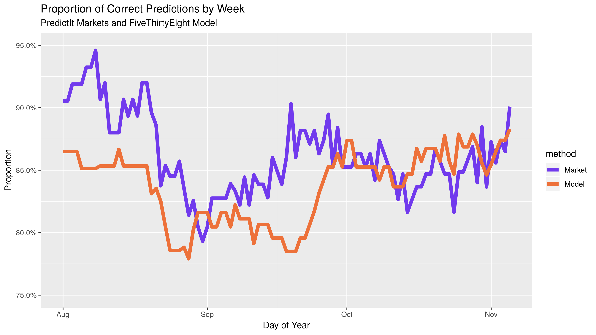
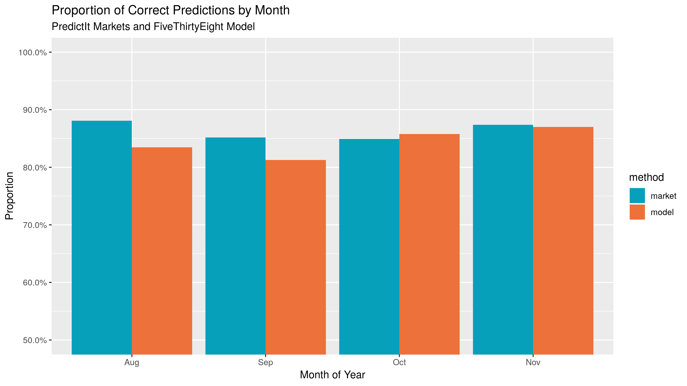

*predictr*
================

  - [Overview](#overview)
  - [Reproduce](#reproduce)
  - [Forecasting Models](#forecasting-models)
      - [Model Inputs](#model-inputs)
      - [Model Output](#model-output)
  - [Prediction Markets](#prediction-markets)
      - [Market Inputs](#market-inputs)
      - [Market Output](#market-output)
  - [Wrangling](#wrangling)
  - [Exploration](#exploration)
  - [Findings](#findings)

## Overview

The forecast model has become a staple of political punditry in recent
years. Popularized by the data journalism site
[FiveThirtyEight](https://fivethirtyeight.com/), the forecasting model
is a statistical tool used to incorporate a number of quantitative
inputs and output a *probabilistic* view of all possible outcomes.

Prediction markets can be used as alternative method of generating
similarly probabilistic views of election outcomes. Markets utilize the
economic forces of price discovery and risk aversion to overcome the
ideological bias of self-interested traders on a binary options
exchange.

Can markets help us predict elections better than the models? If so,
under what conditions?

I propose a null hypothesis of no difference between the proportion of
accurate predictions made by forecasting models and prediction markets
in the 2018 congressional midterm elections.

## Reproduce

All public input data has been saved on the [internet
archive](https://archive.org/) and can be accessed through their wayback
machine.

Data reading, wrangling, combining, and visualization is done primarily
using R packages from the [`tidyverse`](https://github.com/tidyverse/)
collection. Installing those packages should contain all functions
needed to run the project.

``` r
install.packages("tidyverse")
library(tidyverse)
library(lubridate)
library(magrittr)
```

The R scripts in the [`/code`](/code) folder can be run in sequential
order to reproduce the project findings.

1.  Scrape data using `readr` in
    [`01_read_inputs.R`](code/01_read_inputs.R)
2.  Format with `dplyr` in
    [`02_format_inputs.R`](code/02_format_inputs.R)
3.  Analyze with `stats` in
    [`03_compare_methods.R`](code/03_compare_methods.R)
4.  Visualize with `ggplot2` in
    [`04_explore_visually.R`](code/04_explore_viz.R)

<!-- end list -->

``` r
source("code/01_read_inputs.R")
source("code/02_format_inputs.R")
source("code/03_compare_methods.R")
source("code/04_explore_visually.R")
```

## Forecasting Models

As FiveThirtyEight’s founder explains in their [methedological
article](https://fivethirtyeight.com/methodology/how-fivethirtyeights-house-and-senate-models-work/):

> (Forecasting models) take lots of polls, perform various types of
> adjustments to them, and then blend them with other kinds of
> empirically useful indicators (what we sometimes call “the
> fundamentals”) to forecast each race. Then they account for the
> uncertainty in the forecast and simulate the election thousands of
> times.

I will be using the FiveThirtyEight model data to represent the best
capabilities of statistical election forecasting. FiveThirtyEight has a
track record of accuracy over the last decade. Furthermore, they make
the top-line output of their model free to the public.

The goal of these mathematical forecasting models is, [according to
Silver](https://fivethirtyeight.com/features/how-the-fivethirtyeight-senate-forecast-model-works/),
“not to divine some magic formula that miraculously predicts every
election. Instead, it’s to make sense of publicly available information
in a rigorous and disciplined way.”

### Model Inputs

FiveThirtyEight’s 2018 model incorporates four types of data:

1.  **Polling:** District level polling. [FiveThirtyEight rates
    pollsters](https://projects.fivethirtyeight.com/pollster-ratings/)
    to adjust their findings.
2.  **CANTOR:** A proprietary algorithm to identify similar
    congressional districts to infer results for polling-sparce
    districts.
3.  **Fundamentals:** Non-polling factors that historically help in
    predicting congressional races:
      - Incumbency
      - Partisanship
      - Previous margin
      - Generic ballot
      - Fundraising
      - Incumbent voting
      - Challenger experience
      - [Scandals](https://docs.google.com/spreadsheets/d/1ksBLxRR3GCZd33IvhkcNqqBd5K8HwlWC7YuAkVmS1lg/)
4.  **Expert forecasts:** Ratings published by the historically accurate
    experts at the [Cook Political Report](https://cookpolitical.com/),
    [Inside Elections](https://insideelections.com/), and [Sabato’s
    Crystal Ball](http://www.centerforpolitics.org/crystalball/).

FiveThirtyEight uses these inputs to generate three models. Their
“classic” model incorporates polling, CANTOR, and fundamentals and is
considered the default model.

In [describing](http://53eig.ht/1u2pSbD) the process of their 2014
Senate Model, Silver described the general process by which the above
inputs are incorporated in producing a probabilistic output:

> First, (forecasting models) calculate the most likely outcome in a
> particular state (“The Republican wins by 1 point”) and then they
> determine the degree of uncertainty around that estimate. Most models
> do this by means of a normal distribution or something similar to it.

In an analysis of past elections, it has been proven that the degree of
uncertainty is *greater* when:

1.  There are fewer polls
2.  The race is more lopsided
3.  The election is further away
4.  The polls disagree more with one another
5.  There are more undecideds or third-party voters
6.  The polling average disagrees more with the fundamentals

With these quantitative factors in mind, the model calculates the
probability distribution in each candidate’s share of the vote.

The model then uses these calculations to run a Monte Carlo simulation.
In each iteration of the simulation, a share of the vote for each
candidate in a race is drawn from the above probability distributions. A
winner is determined and the simulation runs again. The percentage of
simulated elections won is analogous to the probability of victory on
election night.

### Model Output

FiveThirtyEight makes a portion of their model’s output public as four
files:

1.  [`senate_national_forecast.csv`](https://projects.fivethirtyeight.com/congress-model-2018/senate_national_forecast.csv)
2.  [`house_national_forecast.csv`](https://projects.fivethirtyeight.com/congress-model-2018/house_national_forecast.csv)
3.  [`senate_seat_forecast.csv`](https://projects.fivethirtyeight.com/congress-model-2018/senate_seat_forecast.csv)
4.  [`house_district_forecast.csv`](https://projects.fivethirtyeight.com/congress-model-2018/house_district_forecast.csv)

The two national forecast files contain FiveThirtyEight’s daily
calculations for each party’s probability of winning a majority in their
respective chambers.

The Senate seat and House district level forecasts will be used in this
project. Each observation represents one candidate’s probability of
victory on one day.

There are 28353 observations in the Senate seat level file and 299760
for the House. Together, there are an average of 3348 unique daily
predictions spanning from `rmin(model_combined$forecastdate)` to
2018-11-06.

For each observation, there are 12 variables recorded:

1.  Date
2.  State
3.  District or Senate class
4.  Election type (regular or special)
5.  Candidate
6.  Political party
7.  Model version
8.  **Probability of victory**
9.  Expected share of the vote
10. Minimum share of the vote
11. Maximum share of the vote

Below is a random sample of observations from the combined House
district and Senate seat congressional model data sets.

| Date       | State | District | Party | Incumbent | Probability | Vote Share |
| :--------- | :---- | :------- | :---- | :-------- | ----------: | ---------: |
| 2018-08-30 | WI    | 1        | R     | FALSE     |       0.080 |      44.75 |
| 2018-09-14 | AR    | 2        | LIB   | FALSE     |       0.000 |       2.87 |
| 2018-10-03 | KY    | 3        | LIB   | FALSE     |       0.000 |       2.92 |
| 2018-10-13 | FL    | 9        | D     | TRUE      |       0.982 |      58.83 |
| 2018-10-26 | NV    | 2        | R     | TRUE      |       0.952 |      57.78 |

## Prediction Markets

As summarized [on
Wikipedia](https://en.wikipedia.org/wiki/Prediction_market):

> Prediction markets are exchange-traded markets created for the purpose
> of trading the outcome of events. The market prices can indicate what
> the crowd thinks the probability of the event is. A prediction market
> contract trades between 0 and 100%… The main purposes of prediction
> markets are eliciting aggregating beliefs over an unknown future
> outcome. Traders with different beliefs trade on contracts whose
> payoffs are related to the unknown future outcome and the market
> prices of the contracts are considered as the aggregated belief.

I will be using the market history of the PredictIt exchange run by
Victoria University of Wellington, New Zealand. PredictIt is one of the
few prediction markets permitted to operate domestically. PredictIt
partners with academic researchers to provide market history free of
charge.

### Market Inputs

The fundamental input to a prediction market is a bet between two
traders. These bets are made in the form of binary futures contracts
that expire for a fixed price based on the outcome of some future event.
PredictIt runs a continuous double-auction exchange where traders buy
and sell shares of futures contracts. As a trader’s perception of
probabilities changes, they can sell owned shares, causing the market
equilibrium price to update accordingly.

Traders on PredictIt place bets using real money. The greater the volume
of money traded on a market, the better the forces of price discovery
can determine equilibrium.

### Market Output

The history of this market price is provided to researchers. As
[PredictIt outlines](https://www.predictit.org/research) in their data
use agreement:

> In order to take full advantage of the research opportunities
> presented by prediction markets like PredictIt, we make our data
> available to members of the academic community at no cost. PredictIt’s
> market data offers researchers a wealth of information that can be
> used to further our understanding of a wide array of subjects in
> fields of study as diverse as microeconomics, political behavior,
> computer science and game theory.

[The PredictIt API](https://www.predictit.org/api/marketdata/all/) was
scraped before the election to find all market ID’s related to 2018
Congressional elections. PredictIt then provided the price history in
the [`data/DailyMarketData.csv`](data/DailyMarketData.csv) file.

Each observation represents one day’s opening, closing, low, and high
price for a single contract from a single market. There are 44711
observations covering 145 contracts across 118 markets. For each
observation there are 11 variables:

1.  Market ID
2.  Market name
3.  Market symbol
4.  Contract name
5.  Contract symbol
6.  Prediction date
7.  Opening contract price
8.  Low contract price
9.  High contract price
10. **Closing contract price**
11. Volume of shares traded

Below is a random sample of observations from the PredictIt trading
markets.

| ID   | Market                | Date       | Open |  Low | High | Close | Volume |
| :--- | :-------------------- | :--------- | ---: | ---: | ---: | ----: | -----: |
| 2940 | SANDERS.VTSENATE.2018 | 2017-04-24 | 0.82 | 0.82 | 0.82 |  0.82 |    300 |
| 4177 | PASEN18               | 2018-03-17 | 0.15 | 0.15 | 0.15 |  0.15 |      0 |
| 3522 | DENH.CA10.2018        | 2018-05-04 | 0.31 | 0.31 | 0.31 |  0.31 |      0 |
| 4281 | CT05.2018             | 2018-05-20 | 0.16 | 0.16 | 0.16 |  0.16 |      0 |
| 4016 | PA09.2018             | 2018-07-25 | 0.90 | 0.90 | 0.90 |  0.90 |      0 |

## Wrangling

The above data sets were both formatted to contain two variables: `date`
and `race`. Together, these variables create a relational key that can
be used to join the two data sets for comparison.

For model data, the new `race` variable is created by combining the old
`state` and `district` variables. For market data, the new `race` code
is extracted from the old `MarketSymbol` variable.

Observations can then be gathered to make the single combined data frame
[tidy](http://vita.had.co.nz/papers/tidy-data.html), with each
observation representing *one* prediction (on one date, for one party,
from one predictive method).

Redundant complimentary predictions are removed by selecting only
democratic party probabilities. For markets comprised of yes/no
contracts on a single Republican incumbent’s re-election probability,
the price can be inverted to reflect the Democrat’s probability.

Below is a sample of the tidy data frame with historical predictions.
There are 17694 observations of 4 variables:

1.  Prediction date
2.  Election code
3.  Predictive method
4.  **Win probability**

<!-- end list -->

``` r
inner_join(x    = markets2, 
           y    = model2, 
           by   = c("date", "race")) %>%
  filter(date   > "2018-07-31",
         date   < "2018-11-06") %>%
  rename(model  = prob,
         market = close) %>% 
  gather(key    = method,
         value  = prob,
         model, market) %>%
  arrange(date, race, method)
```

| Date       | Race  | Method | Probability |
| :--------- | :---- | :----- | ----------: |
| 2018-08-01 | AZ-S1 | market |      0.6600 |
| 2018-08-01 | AZ-S1 | model  |      0.7380 |
| 2018-08-01 | CA-12 | market |      0.9100 |
| 2018-08-01 | CA-12 | model  |      1.0000 |
| 2018-08-01 | CA-22 | market |      0.3000 |
| 2018-08-01 | CA-22 | model  |      0.0493 |
| 2018-08-01 | CA-25 | market |      0.6100 |
| 2018-08-01 | CA-25 | model  |      0.7453 |
| 2018-08-01 | CA-39 | market |      0.6100 |
| 2018-08-01 | CA-39 | model  |      0.3768 |

## Exploration






## Findings

Ultimately, a probabilistic view of an election makes a prediction about
the winner. Whether it’s a 99% probability or 51%, a winner is
predicted. This is a unfortunately reductive view of forecasting, but
will be useful to test their predictive capabilities.

An analysis asks if the prediction matches the eventual winner.

| Date       | Race  | Method | Predicted | Winner | Correct |
| :--------- | :---- | :----- | :-------- | :----- | :------ |
| 2018-08-01 | AZ-S1 | market | TRUE      | TRUE   | TRUE    |
| 2018-08-01 | AZ-S1 | model  | TRUE      | TRUE   | TRUE    |
| 2018-08-01 | CA-12 | market | TRUE      | TRUE   | TRUE    |
| 2018-08-01 | CA-12 | model  | TRUE      | TRUE   | TRUE    |
| 2018-08-01 | CA-22 | market | FALSE     | FALSE  | TRUE    |
| 2018-08-01 | CA-22 | model  | FALSE     | FALSE  | TRUE    |
| 2018-08-01 | CA-25 | market | TRUE      | TRUE   | TRUE    |
| 2018-08-01 | CA-25 | model  | TRUE      | TRUE   | TRUE    |
| 2018-08-01 | CA-39 | market | TRUE      | TRUE   | TRUE    |
| 2018-08-01 | CA-39 | model  | FALSE     | TRUE   | FALSE   |

A Welch Two Sample t-test is then performed. The null hypothesis holds
that the difference in proportion of the hits and misses will be zero.
The alternative hypothesis holds that the market will produce a greater
proportion of hits.

``` r
hits %$% t.test(hit ~ method, alternative = "greater") %>% pander()
```

| Test statistic |  df   |      P value       | Alternative hypothesis |
| :------------: | :---: | :----------------: | :--------------------: |
|     4.121      | 17433 | 1.895e-05 \* \* \* |        greater         |

Welch Two Sample t-test: `hit` by `method` (continued below)

| mean in group market | mean in group model |
| :------------------: | :-----------------: |
|        0.8603        |       0.8381        |
