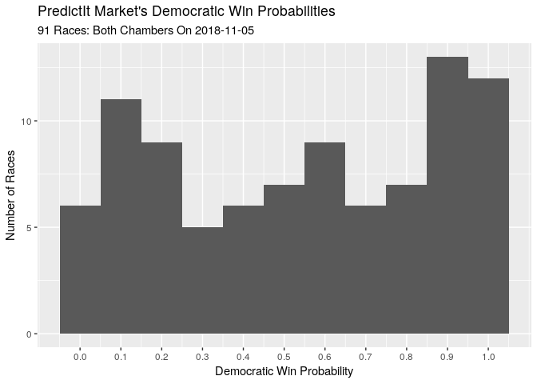

*predictr*
==========

Using R to compare the predictive capabilities of markets and models.

1.  [Project Background](#project-background)
2.  [Predictive Methods](#predictive-methods)
    1.  [Polling and Aggregation](###polling-and-aggregation)
    2.  [Forecasting Models](#forecasting-models)
    3.  [Prediction Markets](#prediction-markets)
3.  [Prediction Data](#prediction-data)
    1.  [FiveThirtyEight Model](#fivethirtyeight-model)
    2.  [PredictIt Markets](#predictit-markets)
4.  [Data Wrangling](#data-wrangling)
5.  [Data Exploration](#data-exploration)
6.  [Project Findings](#project-findings)
7.  [Conclusion](#conclusion)
8.  [Bibliography](#bibliography)

Project
-------

The forecast model has become a staple of political punditry.
Popularized by the data journalism site
[FiveThirtyEight](https://fivethirtyeight.com/ "538 home page"), the
forecast model is a statistical tool used to incorporate a number of
quantitative inputs and output a probabilistic view of all possible
outcomes.

Markets can be used as alternative method of generating similarly
probabalistic views of election outcomes. Markets utlize the economic
forces of price discovery and risk aversion to overcome the implicit
bias of self-interested traders.

I posit a null hypothesis of no difference in accuracy between
forecasting models and prediction markets in their ability to predict
2018 congressional midterm elections.

I will be using model data from the proprietary model written by the
journalist at FiveThirtyEight.com and market data from the PredictIt.org
exchange run by the Victoria University of Wellington, New Zealand.

Predictive Methods
------------------

### Polling and Aggrigation

Opinion polling is the most common form of election predicting. By
[randomly
sampling](https://en.wikipedia.org/wiki/Sampling_(statistics) "Sandom sampling wiki")
the overall population of potential voters, pollsters can ask a thousand
Americans their voting intentions and determine the likely division of
votes in the actual election. Sampling errors and systemic errors
prevent this statistical tool from perfectly predicting the election. By
aggregating a bunch of polls and averaging their results, sites like
[RealClearPolitics](https://www.realclearpolitics.com/ "RCP home page")
take advantage of the [law of large
numbers](https://en.wikipedia.org/wiki/Law_of_large_numbers "Law large nums wiki")
to better calculate the true opinion of the population.

### Forecasting Models

In [the
word's](https://fivethirtyeight.com/methodology/how-fivethirtyeights-house-and-senate-models-work/ "538 model how")
of Nate Silver, FiveThirtyEight's founder and primary author of their
model:

> (Forecasting models) take lots of polls, perform various types of
> adjustments to them, and then blend them with other kinds of
> empirically useful indicators (what we sometimes call “the
> fundamentals”) to forecast each race. Then they account for the
> uncertainty in the forecast and simulate the election thousands of
> times.

I will be using the FiveThirtyEight model to collect forecasting data.
In 2016, FiveThirtyEight's prediction was closest to reality. They are
one of the few mainstream forecasters to continue their work into the
2018 midterm elections.

The exact process of the FiveThirtyEight is proprietary, so we can't
know exactly what data is being incorporated in what ways. In the
"classic" version of their model, three types of quantitative data are
used:

1.  **Polling**: District-by-district polling, adjusted for house
    effects and other factors in some unknown way. [FiveThirtyEight
    rates
    pollsters](https://projects.fivethirtyeight.com/pollster-ratings/ "538 poll ratings")
    to adjust their findings.
2.  **C.A.N.T.O.R.**: A proprietary system which infers results for
    districts with little or no polling from similar districts where
    polling has been done.
3.  **Fundamentals**: Non-polling factors that historically help in
    predicting congressional races:
    -   Incumbency
    -   State partisanship
    -   Incumbent previous margins
    -   Generic ballot
    -   Fundraising
    -   Incumbent voting record
    -   Challenger experience
    -   Scandals

From everything that has been said publicly about the mathematics of
their model, FiveThirtyEight uses these quantitative inputs to predict
each candidate's share of the vote. The model is then uses the
statistical program Stata to run a [Monte Carlo
simulation](https://en.wikipedia.org/wiki/Monte_Carlo_method "Monte carlo sim wiki").
By predicting the lower limit, upper limit, central tendency, and
distribution of shares of the vote for two candidates, you can simulate
a given election 20,000 times and simply use the percentage of victories
as the probability of actual victory.

In the training data (most House races since 1998), the classic model
correctly predicted *96.7%* of races at the time of election.
FiveThirtyEight points out that the *vast* majority of races are
blowouts, inflating this accuracy percentage.

### Prediction Markets

As summarized [on
Wikipedia](https://en.wikipedia.org/wiki/Prediction_market "Prediction markets wiki"):

> Prediction markets (also known as predictive markets, information
> markets, decision markets, idea futures, event derivatives, or virtual
> markets) are exchange-traded markets created for the purpose of
> trading the outcome of events. The market prices can indicate what the
> crowd thinks the probability of the event is. A prediction market
> contract trades between 0 and 100%... The main purposes of prediction
> markets are eliciting aggregating beliefs over an unknown future
> outcome. Traders with different beliefs trade on contracts whose
> payoffs are related to the unknown future outcome and the market
> prices of the contracts are considered as the aggregated belief.

By utlizing the economic forces of risk aversion and self-interest,
prediction markets aim to overcome the implicit biases of the traders.
Traders continually buy and sell contracts that pay out at $1 based on
the outcome of the election.

If a trader believes a candidate has a 75% chance of winning an
election, he might buy a hundred contracts at $0.75 each. Should events
unfold to increase or decrease this probability, the trader can sell
these shares for more or less than he originally paid, updating the
market equilibrium price to reflect current probabilities.

Prediction Data
---------------

### FiveThirtyEight Model

The team at FiveThirtyEight made public a portion of their model's
output as four separate `.csv` files on their website:

1.  [Senate national
    forecast](https://projects.fivethirtyeight.com/congress-model-2018/senate_national_forecast.csv "Sen nat model")
2.  [Senate seat
    forecast](https://projects.fivethirtyeight.com/congress-model-2018/senate_seat_forecast.csv "Sen seat model")
3.  [House national
    forecast](https://projects.fivethirtyeight.com/congress-model-2018/house_national_forecast.csv "House nat model")
4.  [House district
    forecasts](https://projects.fivethirtyeight.com/congress-model-2018/house_district_forecast.csv "House dis model")

The two national forecasts provide the FiveThirtyEight calculations for
each party's probability of winning a majority in their respective
chambers on any given day (e.g., "The Democratic party has an 85% chance
of winning a majority in the House").

The seat and district level forecasts will be used in this project. Each
observation represents one day's probability of victory for one
candidate. There are 28,353 observations in the Senate seat level file
and 302,859 for the House district level. For each observation, there
are 12 variables recorded:

1.  The date of the prediction (starting on 2018-08-01)
2.  The State the election is in
3.  The Congressional district the election is in
4.  Whether the election is a "special election"
5.  The candidate's full name
6.  The candidate's political party
7.  The model version (classic, lite, or deluxe)
8.  The candidate's probability of victory
9.  The candidate's expected share of the vote (50th percentile)
10. The candidate's ~minimum share of the vote (10th percentile)
11. The candidate's ~maximum share of the vote (90th percentile)

Below is a random sample of observations from the FiveThirtyEight
congressional district model.

<table style="width:100%;">
<colgroup>
<col width="10%" />
<col width="6%" />
<col width="8%" />
<col width="15%" />
<col width="6%" />
<col width="9%" />
<col width="14%" />
<col width="9%" />
<col width="9%" />
<col width="9%" />
</colgroup>
<thead>
<tr class="header">
<th align="left">Date</th>
<th align="left">State</th>
<th align="right">District</th>
<th align="left">Candidate</th>
<th align="left">Party</th>
<th align="left">Incumbent</th>
<th align="right">Win Probability</th>
<th align="right">Avg Share</th>
<th align="right">Min Share</th>
<th align="right">Max Share</th>
</tr>
</thead>
<tbody>
<tr class="odd">
<td align="left">2018-08-20</td>
<td align="left">AL</td>
<td align="right">3</td>
<td align="left">Mike Rogers</td>
<td align="left">R</td>
<td align="left">TRUE</td>
<td align="right">0.9951</td>
<td align="right">65.18</td>
<td align="right">58.25</td>
<td align="right">72.05</td>
</tr>
<tr class="even">
<td align="left">2018-10-27</td>
<td align="left">KS</td>
<td align="right">3</td>
<td align="left">Sharice Davids</td>
<td align="left">D</td>
<td align="left">FALSE</td>
<td align="right">0.7832</td>
<td align="right">50.96</td>
<td align="right">46.49</td>
<td align="right">55.36</td>
</tr>
<tr class="odd">
<td align="left">2018-10-06</td>
<td align="left">VA</td>
<td align="right">5</td>
<td align="left">Denver Riggleman</td>
<td align="left">R</td>
<td align="left">FALSE</td>
<td align="right">0.6504</td>
<td align="right">51.45</td>
<td align="right">46.45</td>
<td align="right">56.39</td>
</tr>
<tr class="even">
<td align="left">2018-10-16</td>
<td align="left">TX</td>
<td align="right">31</td>
<td align="left">John Carter</td>
<td align="left">R</td>
<td align="left">TRUE</td>
<td align="right">0.9178</td>
<td align="right">53.58</td>
<td align="right">48.83</td>
<td align="right">58.29</td>
</tr>
<tr class="odd">
<td align="left">2018-09-08</td>
<td align="left">NY</td>
<td align="right">20</td>
<td align="left">Francis Vitollo</td>
<td align="left">R</td>
<td align="left">FALSE</td>
<td align="right">0.0001</td>
<td align="right">31.04</td>
<td align="right">26.10</td>
<td align="right">35.93</td>
</tr>
</tbody>
</table>

### PredictIt Markets

PredictIt markets are comprised of "markets" and "contracts." As they
explain on [their
website](https://www.predictit.org/support/faq "PredictIt FAQ"):

> Every question posed by PredictIt is known as a ‘market’. Some markets
> have simple yes or no answers, while others can have multiple possible
> answers.

> Each possible answer to the question posed in a market is known as a
> ‘contract’. Markets that ask simple yes or no answers are known as
> ‘single-contract markets’, while those with multiple possible choices
> – like the winner of an election – are called ‘multiple-contract
> markets’... Single-contract markets resolve either to ‘Yes’ or ‘No’.
> In multiple-contract markets, only one contract can resolve to ‘Yes’.
> All others will resolve to ‘No’.

On [their
webstie](https://www.predictit.org/research "PredictIt research"),
PredictIt outlines their data agreement with academic researchers:

> In order to take full advantage of the research opportunities
> presented by prediction markets like PredictIt, we make our data
> available to members of the academic community at no cost. PredictIt’s
> market data offers researchers a wealth of information that can be
> used to further our understanding of a wide array of subjects in
> fields of study as diverse as microeconomics, political behavior,
> computer science and game theory.

I scraped [the PredictIt
API](https://www.predictit.org/api/marketdata/all/ "PredictIt API")
before the election and used the data to find all market ID's related to
Congressional elections. PredictIt then provided the relevant market
data as a `.csv` file.

Each observation represents one day's opening, closing, low, and high
price for a single contract from a single market. There are 44,711
observations covering 145 contracts across 118 markets. For each
observation there are 11 variables:

1.  Market ID
2.  Market name (the "question" being asked)
3.  Market symbol
4.  Contract name (the possible "answers")
5.  Contract symbol
6.  Prediction date (earliest is 201-01-27)
7.  Opening contract price
8.  Low contract price
9.  High contract price
10. Closing contract price (that day's final prediction)

Below is a random sample of observations with a selection of variables
to show the structure of the data as provided by PredictIt:

<table>
<colgroup>
<col width="10%" />
<col width="14%" />
<col width="15%" />
<col width="10%" />
<col width="10%" />
<col width="10%" />
<col width="13%" />
<col width="14%" />
</colgroup>
<thead>
<tr class="header">
<th align="left">Market ID</th>
<th align="left">Market Symbol</th>
<th align="left">Contract Symbol</th>
<th align="left">Date</th>
<th align="right">Low Price</th>
<th align="right">High Price</th>
<th align="right">Closing Price</th>
<th align="right">Trading Volume</th>
</tr>
</thead>
<tbody>
<tr class="odd">
<td align="left">3866</td>
<td align="left">VA06.2018</td>
<td align="left">GOP.VA06.2018</td>
<td align="left">2018-05-22</td>
<td align="right">0.85</td>
<td align="right">0.85</td>
<td align="right">0.85</td>
<td align="right">0</td>
</tr>
<tr class="even">
<td align="left">3450</td>
<td align="left">PELO.CA12.2018</td>
<td align="left">NA</td>
<td align="left">2017-10-05</td>
<td align="right">0.85</td>
<td align="right">0.87</td>
<td align="right">0.85</td>
<td align="right">10</td>
</tr>
<tr class="odd">
<td align="left">4015</td>
<td align="left">MD06.2018</td>
<td align="left">GOP.MD06.2018</td>
<td align="left">2018-05-24</td>
<td align="right">0.14</td>
<td align="right">0.14</td>
<td align="right">0.14</td>
<td align="right">0</td>
</tr>
<tr class="even">
<td align="left">4281</td>
<td align="left">CT05.2018</td>
<td align="left">GOP.CT05.2018</td>
<td align="left">2018-09-12</td>
<td align="right">0.10</td>
<td align="right">0.10</td>
<td align="right">0.10</td>
<td align="right">0</td>
</tr>
<tr class="odd">
<td align="left">4105</td>
<td align="left">NY09.2018</td>
<td align="left">DEM.NY09.2018</td>
<td align="left">2018-07-05</td>
<td align="right">0.95</td>
<td align="right">0.95</td>
<td align="right">0.95</td>
<td align="right">0</td>
</tr>
</tbody>
</table>

Data Wrangling
--------------

By formatting the above data sets to contain relational keys of `date`,
`code`, and `party` we can perform a left-wise join on the data to
combine the prediction data from the PredictIt markets and
FiveThirtyEight model. The `code` variable is the primary key, created
with the `state` and `district` variables from FiveThirtyEight and the
`ContractSymbol` variable from PredictIt. For House races, the number is
the Congressional District. For Senate races, "-99" indicates a on-time
election and "-98" indicates a special election.

We then gather the variables to make out data frame "tidy" with each
observation representing one prediction (on one date, for one candidate,
with one method). The resulting data set has 29,602 observations with
nine variables.

<table>
<thead>
<tr class="header">
<th align="left">Date</th>
<th align="left">Race</th>
<th align="left">Candidate</th>
<th align="left">Chamber</th>
<th align="left">Party</th>
<th align="left">Incumbent</th>
<th align="left">Special</th>
<th align="left">Method</th>
<th align="right">Probability</th>
</tr>
</thead>
<tbody>
<tr class="odd">
<td align="left">2018-08-01</td>
<td align="left">AZ-99</td>
<td align="left">McSally</td>
<td align="left">senate</td>
<td align="left">R</td>
<td align="left">FALSE</td>
<td align="left">FALSE</td>
<td align="left">market</td>
<td align="right">0.340</td>
</tr>
<tr class="even">
<td align="left">2018-08-01</td>
<td align="left">AZ-99</td>
<td align="left">McSally</td>
<td align="left">senate</td>
<td align="left">R</td>
<td align="left">FALSE</td>
<td align="left">FALSE</td>
<td align="left">model</td>
<td align="right">0.262</td>
</tr>
<tr class="odd">
<td align="left">2018-08-01</td>
<td align="left">AZ-99</td>
<td align="left">Sinema</td>
<td align="left">senate</td>
<td align="left">D</td>
<td align="left">FALSE</td>
<td align="left">FALSE</td>
<td align="left">market</td>
<td align="right">0.660</td>
</tr>
<tr class="even">
<td align="left">2018-08-01</td>
<td align="left">AZ-99</td>
<td align="left">Sinema</td>
<td align="left">senate</td>
<td align="left">D</td>
<td align="left">FALSE</td>
<td align="left">FALSE</td>
<td align="left">model</td>
<td align="right">0.738</td>
</tr>
<tr class="odd">
<td align="left">2018-08-01</td>
<td align="left">CA-10</td>
<td align="left">Denham</td>
<td align="left">house</td>
<td align="left">R</td>
<td align="left">TRUE</td>
<td align="left">FALSE</td>
<td align="left">market</td>
<td align="right">0.420</td>
</tr>
<tr class="even">
<td align="left">2018-08-01</td>
<td align="left">CA-10</td>
<td align="left">Denham</td>
<td align="left">house</td>
<td align="left">R</td>
<td align="left">TRUE</td>
<td align="left">FALSE</td>
<td align="left">model</td>
<td align="right">0.295</td>
</tr>
<tr class="odd">
<td align="left">2018-08-01</td>
<td align="left">CA-12</td>
<td align="left">Pelosi</td>
<td align="left">house</td>
<td align="left">D</td>
<td align="left">TRUE</td>
<td align="left">FALSE</td>
<td align="left">market</td>
<td align="right">0.910</td>
</tr>
<tr class="even">
<td align="left">2018-08-01</td>
<td align="left">CA-12</td>
<td align="left">Pelosi</td>
<td align="left">house</td>
<td align="left">D</td>
<td align="left">TRUE</td>
<td align="left">FALSE</td>
<td align="left">model</td>
<td align="right">1.000</td>
</tr>
<tr class="odd">
<td align="left">2018-08-01</td>
<td align="left">CA-22</td>
<td align="left">Nunes</td>
<td align="left">house</td>
<td align="left">R</td>
<td align="left">TRUE</td>
<td align="left">FALSE</td>
<td align="left">market</td>
<td align="right">0.700</td>
</tr>
<tr class="even">
<td align="left">2018-08-01</td>
<td align="left">CA-22</td>
<td align="left">Nunes</td>
<td align="left">house</td>
<td align="left">R</td>
<td align="left">TRUE</td>
<td align="left">FALSE</td>
<td align="left">model</td>
<td align="right">0.951</td>
</tr>
</tbody>
</table>

Data Exploration
----------------

The FiveThirtyEight model generates daily probabilities for every
election in both house. The PredictIt.org markets do not; some markets
were open for trading as early as Januray and the rest were added over
time. Furthermore, the traders on PredictIt.org are not interested in
betting on every election, as the vast majority have little risk (only
91 races were traded on prediction markets by election day).

Below are histograms of the Democratic candidate's probabilities the day
before the election with both tools. Note how the model, which includes
every race, gives the vast majority of candidates a less than 10% or
greater than 90% chance of winning their respective elections.

Most of those "safe" elections are not traded on the prediction markets.
The races for which there are markets are much more uniformly
distributed in their probability.

Project Findings
----------------

Conclusion
----------

Biblography
-----------
