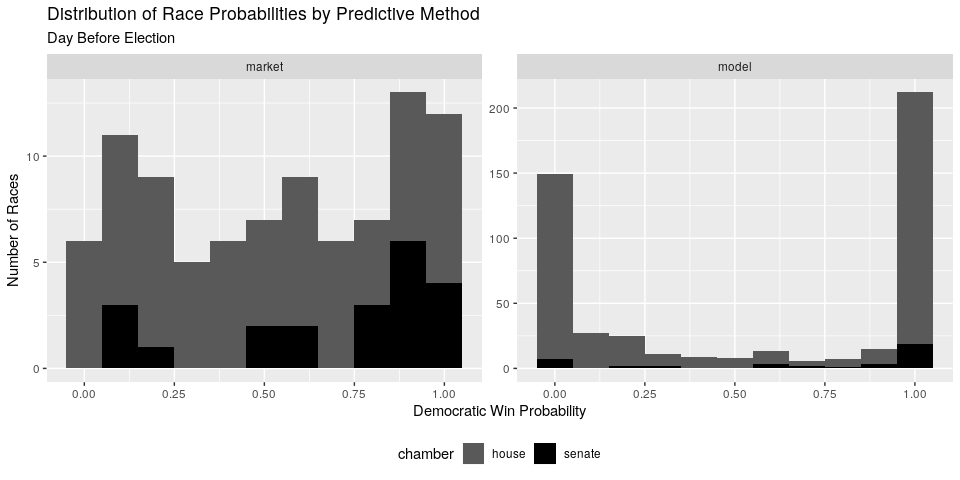
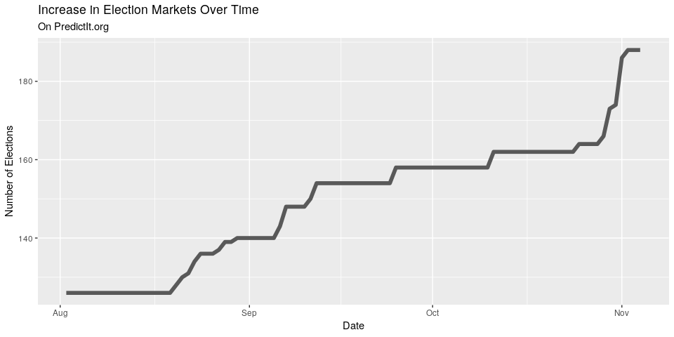

*predictr*
==========

Using R to compare the predictive capabilities of markets and models.

1.  [Project Background](#project-background)
2.  [Predictive Methods](#predictive-methods)
    1.  [Polling and Aggregation](###polling-and-aggregation)
    2.  [Forecasting Models](#forecasting-models)
    3.  [Prediction Markets](#prediction-markets)
3.  [Prediction Data](#prediction-data)
    1.  [FiveThirtyEight Model](#fivethirtyeight-model)
    2.  [PredictIt Markets](#predictit-markets)
4.  [Data Wrangling](#data-wrangling)
5.  [Data Exploration](#data-exploration)

Project
-------

The forecast model has become a staple of political punditry.
Popularized by the data journalism site
[FiveThirtyEight](https://fivethirtyeight.com/ "538 home page"), the
forecast model is a statistical tool used to incorporate a number of
quantitative inputs and output a probabilistic view of all possible
outcomes.

Markets can be used as alternative method of generating similarly
probabilistic views of outcomes. Markets utilize the economic forces of
price discovery and risk aversion to overcome the implicit bias of
self-interested traders on a binary options exchange.

How do these two predictive methods fare in their ability to prediction
elections? I posit a null hypothesis of no difference in accuracy
between forecasting models and prediction markets in their ability to
predict 2018 congressional midterm elections.

I will be using public model data from the proprietary model written by
the journalists at FiveThirtyEight and market data from the PredictIt
exchange run by the Victoria University of Wellington, New Zealand.

Predictive Methods
------------------

### Polling and Aggrigation

Opinion polling is the most common form of election predicting. By
[randomly
sampling](https://en.wikipedia.org/wiki/Sampling_(statistics) "Sandom sampling wiki")
the overall population of potential voters, pollsters can ask a thousand
Americans their voting intentions and determine the likely division of
votes in the actual election. Sampling errors and systemic errors
prevent this statistical tool from perfectly predicting the election. By
aggregating a bunch of polls and averaging result, sites like
[RealClearPolitics](https://www.realclearpolitics.com/ "RCP home page")
take advantage of the [law of large
numbers](https://en.wikipedia.org/wiki/Law_of_large_numbers "Law large nums wiki")
to better calculate the true opinion of the population.

### Forecasting Models

In [the
word's](https://fivethirtyeight.com/methodology/how-fivethirtyeights-house-and-senate-models-work/ "538 model how")
of Nate Silver, FiveThirtyEight's founder and the primary author of
their election forecasting model:

> (Forecasting models) take lots of polls, perform various types of
> adjustments to them, and then blend them with other kinds of
> empirically useful indicators (what we sometimes call “the
> fundamentals”) to forecast each race. Then they account for the
> uncertainty in the forecast and simulate the election thousands of
> times.

I will be using the FiveThirtyEight model's forecasting data. In 2016,
FiveThirtyEight's prediction was closest to reality. They are also one
of the few mainstream forecasters to continue their work into the 2018
midterm elections. Furthermore, the make the top-line output of their
model free to the public.

The exact code of the FiveThirtyEight model is proprietary, so we can't
know exactly what data is being incorporated in what ways. We do know
that the "classic" version of their model uses three types of
quantitative data:

1.  **Polling**: District levek polling. [FiveThirtyEight rates
    pollsters](https://projects.fivethirtyeight.com/pollster-ratings/ "538 poll ratings")
    to adjust their findings. The results are further adjusted three
    times:
    1.  The likely voter adjustment ensures a more accurate sampling
        frame.
    2.  The conservative timeline adjustment to favor recency.
    3.  The house effects adjustment corrects for persistent statistical
        biases.
2.  **CANTOR**: A proprietary k-nearest neighbors algorithm to identify
    similar congressional districts (based on demographic, geographic
    and political factors) to infers results for polling-sparce
    districts.
3.  **Fundamentals**: Non-polling factors that historically help in
    predicting congressional races:
    -   Incumbency
    -   Partisanship
    -   Previous margin
    -   Generic ballot
    -   Fundraising
    -   Incumbent voting
    -   Challenger experience
    -   Scandals

From everything that has been said publicly about the mathematics of
their model, FiveThirtyEight uses these quantitative inputs to predict
each candidate's share of the vote. The model is then uses the
statistical program Stata to run a [Monte Carlo
simulation](https://en.wikipedia.org/wiki/Monte_Carlo_method "Monte carlo sim wiki").
By estimating the probability distribution in two candidate's shares of
the vote, such simulation can be run tens of thousands of times. From
these simulations, the percentage of one candidate winning is equal to
their probability of winning on election day.

In the training data (most House races since 1998), the classic model
correctly predicted **96.7%** of races at the time of election.
FiveThirtyEight points out that the *vast* majority of races are
blowouts and very easy to predict.

### Prediction Markets

As summarized [on
Wikipedia](https://en.wikipedia.org/wiki/Prediction_market "Prediction markets wiki"):

> Prediction markets (also known as predictive markets, information
> markets, decision markets, idea futures, event derivatives, or virtual
> markets) are exchange-traded markets created for the purpose of
> trading the outcome of events. The market prices can indicate what the
> crowd thinks the probability of the event is. A prediction market
> contract trades between 0 and 100%... The main purposes of prediction
> markets are eliciting aggregating beliefs over an unknown future
> outcome. Traders with different beliefs trade on contracts whose
> payoffs are related to the unknown future outcome and the market
> prices of the contracts are considered as the aggregated belief.

By utilizing the economic forces of risk aversion and self-interest,
prediction markets aim to overcome the implicit biases of the traders.
Traders continually buy and sell contracts that pay out at $1 based on
the outcome of the election.

If a trader believes a candidate has a 75% chance of winning an
election, he should buy a hundred contracts at a price less than $0.75
each. Should events unfold to increase or decrease this probability, the
trader can sell these shares for more or less than he originally paid,
updating the market equilibrium price to reflect current probabilities.

Prediction Data
---------------

### FiveThirtyEight Model Data

The team at FiveThirtyEight makes public a portion of their model's
output as four separate `.csv` files on their website:

1.  [`senate_national_forecast.csv`](https://projects.fivethirtyeight.com/congress-model-2018/senate_national_forecast.csv "Sen nat model")
2.  [`senate_seat_forecast.csv`](https://projects.fivethirtyeight.com/congress-model-2018/senate_seat_forecast.csv "Sen seat model")
3.  [`house_national_forecast.csv`](https://projects.fivethirtyeight.com/congress-model-2018/house_national_forecast.csv "House nat model")
4.  [`house_district_forecast.csv`](https://projects.fivethirtyeight.com/congress-model-2018/house_district_forecast.csv "House dis model")

The two national forecasts provide the FiveThirtyEight calculations for
each party's probability of winning a majority in their respective
chambers on any given day (e.g., "Today, he Democratic party has an 85%
chance of winning control of the House of Representatives with a simple
majority of seats").

The Senate seat and House district level forecasts will be used in this
project. Each observation represents one day's probability of victory
for one candidate. There are 28,353 observations in the Senate seat
level file and 302,859 for the House district level. Together, There are
about 3,380 unique daily predictions from August 1st to November 5th (97
days).

For each observation, there are 12 variables recorded:

1.  The date of the prediction
2.  The State the election is in
3.  The Congressional district the election is in
4.  Whether the election is a "special election"
5.  The candidate's full name
6.  The candidate's political party
7.  The model version (classic, lite, or deluxe)
8.  The candidate's probability of victory
9.  The candidate's expected share of the vote
10. The candidate's ≈minimum share of the vote
11. The candidate's ≈maximum share of the vote

Below is a random sample of observations from the FiveThirtyEight
congressional district model data set.

<table>
<thead>
<tr class="header">
<th align="left">Date</th>
<th align="left">State</th>
<th align="right">District</th>
<th align="left">Special</th>
<th align="left">Party</th>
<th align="left">Incumbent</th>
<th align="left">Model</th>
<th align="right">Win Prob.</th>
<th align="right">Avg Share</th>
</tr>
</thead>
<tbody>
<tr class="odd">
<td align="left">2018-08-12</td>
<td align="left">NC</td>
<td align="right">6</td>
<td align="left">NA</td>
<td align="left">R</td>
<td align="left">TRUE</td>
<td align="left">deluxe</td>
<td align="right">0.914</td>
<td align="right">55.87</td>
</tr>
<tr class="even">
<td align="left">2018-10-06</td>
<td align="left">TN</td>
<td align="right">7</td>
<td align="left">NA</td>
<td align="left">NA</td>
<td align="left">FALSE</td>
<td align="left">lite</td>
<td align="right">0.000</td>
<td align="right">4.00</td>
</tr>
<tr class="odd">
<td align="left">2018-10-19</td>
<td align="left">ND</td>
<td align="right">1</td>
<td align="left">NA</td>
<td align="left">R</td>
<td align="left">FALSE</td>
<td align="left">deluxe</td>
<td align="right">0.997</td>
<td align="right">57.32</td>
</tr>
<tr class="even">
<td align="left">2018-10-06</td>
<td align="left">LA</td>
<td align="right">3</td>
<td align="left">NA</td>
<td align="left">D</td>
<td align="left">FALSE</td>
<td align="left">deluxe</td>
<td align="right">0.000</td>
<td align="right">13.54</td>
</tr>
<tr class="odd">
<td align="left">2018-10-20</td>
<td align="left">OH</td>
<td align="right">6</td>
<td align="left">NA</td>
<td align="left">D</td>
<td align="left">FALSE</td>
<td align="left">deluxe</td>
<td align="right">0.000</td>
<td align="right">32.02</td>
</tr>
</tbody>
</table>

### PredictIt Markets Data

PredictIt markets are comprised of "markets" and "contracts." As they
explain on [their
website](https://www.predictit.org/support/faq "PredictIt FAQ"):

> Every question posed by PredictIt is known as a "market" ... Each
> possible answer to the question posed in a market is known as a
> "contract" ... Single-contract markets resolve either to "Yes" or
> "No".

On [their
webstie](https://www.predictit.org/research "PredictIt research"),
PredictIt outlines their data agreement with academic researchers:

> In order to take full advantage of the research opportunities
> presented by prediction markets like PredictIt, we make our data
> available to members of the academic community at no cost. PredictIt’s
> market data offers researchers a wealth of information that can be
> used to further our understanding of a wide array of subjects in
> fields of study as diverse as microeconomics, political behavior,
> computer science and game theory.

I scraped [the PredictIt
API](https://www.predictit.org/api/marketdata/all/ "PredictIt API")
before the election and used the data to find all market ID's related to
Congressional elections. PredictIt then provided the relevant market
data as a `.csv` file.

Each observation represents one day's opening, closing, low, and high
price for a single contract from a single market. There are 44,711
observations covering 145 contracts across 118 markets. For each
observation there are 11 variables:

1.  Market ID
2.  Market name
3.  Market symbol
4.  Contract name
5.  Contract symbol
6.  Prediction date
7.  Opening contract price
8.  Low contract price
9.  High contract price
10. Closing contract price

Below is a random sample of observations from the PredictIt trading
markets.

<table>
<thead>
<tr class="header">
<th align="left">ID</th>
<th align="left">Market</th>
<th align="left">Contract</th>
<th align="left">Date</th>
<th align="right">Low</th>
<th align="right">High</th>
<th align="right">Close</th>
<th align="right">Volume</th>
</tr>
</thead>
<tbody>
<tr class="odd">
<td align="left">4192</td>
<td align="left">SPEC.MSSEN.18</td>
<td align="left">DEM.SPEC.MSSEN.18</td>
<td align="left">2018-04-10</td>
<td align="right">0.25</td>
<td align="right">0.25</td>
<td align="right">0.25</td>
<td align="right">0</td>
</tr>
<tr class="even">
<td align="left">3767</td>
<td align="left">NH01.2018</td>
<td align="left">DEM.NH01.2018</td>
<td align="left">2018-03-22</td>
<td align="right">0.79</td>
<td align="right">0.79</td>
<td align="right">0.79</td>
<td align="right">0</td>
</tr>
<tr class="odd">
<td align="left">4104</td>
<td align="left">NJ11.2018</td>
<td align="left">DEM.NJ11.2018</td>
<td align="left">2018-09-28</td>
<td align="right">0.80</td>
<td align="right">0.82</td>
<td align="right">0.82</td>
<td align="right">10</td>
</tr>
<tr class="even">
<td align="left">3772</td>
<td align="left">TNSEN18</td>
<td align="left">DEM.TNSEN18</td>
<td align="left">2018-03-09</td>
<td align="right">0.32</td>
<td align="right">0.34</td>
<td align="right">0.34</td>
<td align="right">10</td>
</tr>
<tr class="odd">
<td align="left">4256</td>
<td align="left">MI08.2018</td>
<td align="left">GOP.MI08.2018</td>
<td align="left">2018-08-01</td>
<td align="right">0.59</td>
<td align="right">0.59</td>
<td align="right">0.59</td>
<td align="right">0</td>
</tr>
</tbody>
</table>

Data Wrangling
--------------

The above data sets were formatted to contain three keys variables:
`date`, `race`, and `party`. With these variables shared for each
observation across both the model and market data sets, a relational
join can be performed.

For model data, the `race` variable is created by combinding the `state`
and `district` variables. For market data, the race code is extracted
from the `MarketSymbol` variable.

The `party` variable is included in the model data by default. For
market data, House race party variables are extracted from "DEM" and
"GOP" in the `ContractSymbol` character string. Senate race party
variables are obtained using the incumbet's name in the `MarketSymbol`
character string and the `/congress-legislators` data set maintained by
the @United States project.

We then gather the variables to make the single data frame
"[tidy](http://vita.had.co.nz/papers/tidy-data.html "Tidy data")" with
each observation representing one prediction (on one date, for one
candidate, with one method). The resulting data set has 29,602
observations with nine variables.

<table>
<thead>
<tr class="header">
<th align="left">Date</th>
<th align="left">Race</th>
<th align="left">Name</th>
<th align="left">Chamber</th>
<th align="left">Party</th>
<th align="left">Incumbent</th>
<th align="left">Special</th>
<th align="left">Method</th>
<th align="right">Probability</th>
</tr>
</thead>
<tbody>
<tr class="odd">
<td align="left">2018-08-02</td>
<td align="left">AZ-99</td>
<td align="left">McSally</td>
<td align="left">senate</td>
<td align="left">R</td>
<td align="left">FALSE</td>
<td align="left">FALSE</td>
<td align="left">market</td>
<td align="right">0.350</td>
</tr>
<tr class="even">
<td align="left">2018-08-02</td>
<td align="left">AZ-99</td>
<td align="left">McSally</td>
<td align="left">senate</td>
<td align="left">R</td>
<td align="left">FALSE</td>
<td align="left">FALSE</td>
<td align="left">model</td>
<td align="right">0.271</td>
</tr>
<tr class="odd">
<td align="left">2018-08-02</td>
<td align="left">AZ-99</td>
<td align="left">Sinema</td>
<td align="left">senate</td>
<td align="left">D</td>
<td align="left">FALSE</td>
<td align="left">FALSE</td>
<td align="left">market</td>
<td align="right">0.660</td>
</tr>
<tr class="even">
<td align="left">2018-08-02</td>
<td align="left">AZ-99</td>
<td align="left">Sinema</td>
<td align="left">senate</td>
<td align="left">D</td>
<td align="left">FALSE</td>
<td align="left">FALSE</td>
<td align="left">model</td>
<td align="right">0.729</td>
</tr>
<tr class="odd">
<td align="left">2018-08-02</td>
<td align="left">CA-10</td>
<td align="left">Denham</td>
<td align="left">house</td>
<td align="left">R</td>
<td align="left">TRUE</td>
<td align="left">FALSE</td>
<td align="left">market</td>
<td align="right">0.420</td>
</tr>
<tr class="even">
<td align="left">2018-08-02</td>
<td align="left">CA-10</td>
<td align="left">Denham</td>
<td align="left">house</td>
<td align="left">R</td>
<td align="left">TRUE</td>
<td align="left">FALSE</td>
<td align="left">model</td>
<td align="right">0.309</td>
</tr>
<tr class="odd">
<td align="left">2018-08-02</td>
<td align="left">CA-12</td>
<td align="left">Pelosi</td>
<td align="left">house</td>
<td align="left">D</td>
<td align="left">TRUE</td>
<td align="left">FALSE</td>
<td align="left">market</td>
<td align="right">0.900</td>
</tr>
<tr class="even">
<td align="left">2018-08-02</td>
<td align="left">CA-12</td>
<td align="left">Pelosi</td>
<td align="left">house</td>
<td align="left">D</td>
<td align="left">TRUE</td>
<td align="left">FALSE</td>
<td align="left">model</td>
<td align="right">1.000</td>
</tr>
<tr class="odd">
<td align="left">2018-08-02</td>
<td align="left">CA-22</td>
<td align="left">Nunes</td>
<td align="left">house</td>
<td align="left">R</td>
<td align="left">TRUE</td>
<td align="left">FALSE</td>
<td align="left">market</td>
<td align="right">0.700</td>
</tr>
<tr class="even">
<td align="left">2018-08-02</td>
<td align="left">CA-22</td>
<td align="left">Nunes</td>
<td align="left">house</td>
<td align="left">R</td>
<td align="left">TRUE</td>
<td align="left">FALSE</td>
<td align="left">model</td>
<td align="right">0.952</td>
</tr>
</tbody>
</table>

Data Exploration
----------------

The FiveThirtyEight model generates daily probabilities for every
election in both chambers. On PredictIt.org, some markets were open for
trading as early as January and the rest were added over time.
Furthermore, the traders on PredictIt.org are not interested in betting
on every election, as the vast majority have little risk (only 91 races
were traded on prediction markets by election day).

Below are histograms of the Democratic candidates' probabilities the day
before the election, split by the predictive method used. The model,
which includes every race, gives the vast majority of candidates a less
than 10% or greater than 90% chance of winning their respective
elections. The markets, which only exist for the most contentious and
popular raves, are more uniform it its distribution of probabilities.

------------------------------------------------------------------------
