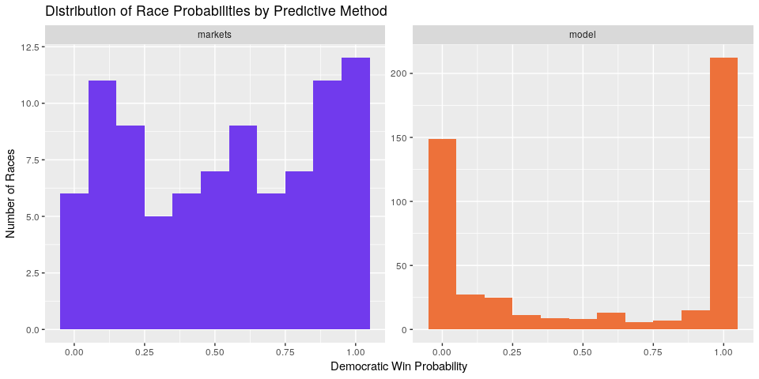
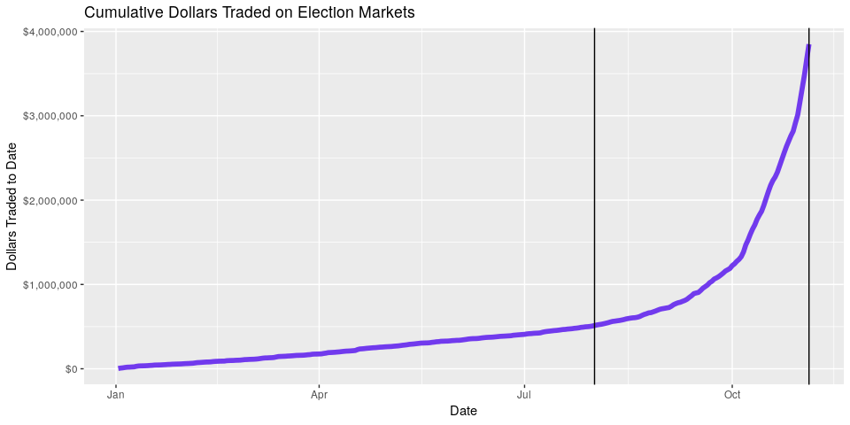
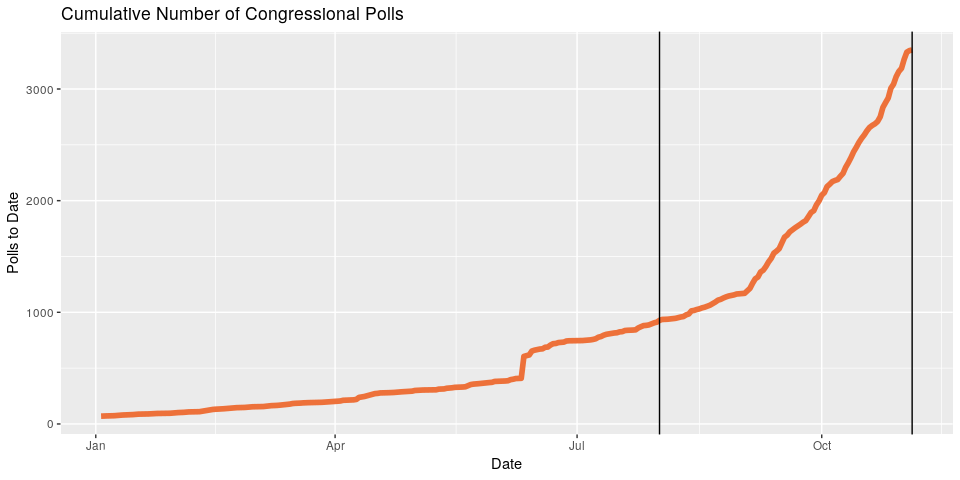
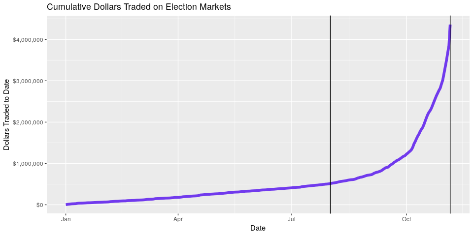

-   [Predictive Methods](#predictive-methods)
    -   [Polling and Aggrigation](#polling-and-aggrigation)
    -   [Forecasting Models](#forecasting-models)
    -   [Prediction Markets](#prediction-markets)
-   [Prediction Data](#prediction-data)
    -   [FiveThirtyEight Model Data](#fivethirtyeight-model-data)
    -   [PredictIt Markets Data](#predictit-markets-data)
-   [Data Wrangling](#data-wrangling)
-   [Data Exploration](#data-exploration)

The forecast model has become a staple of political punditry.
Popularized by the data journalism site
[FiveThirtyEight](https://fivethirtyeight.com/ "538 home page"), the
forecast model is a statistical tool used to incorporate a number of
quantitative inputs and output a *probabilistic* view of all possible
outcomes.

Markets can be used as alternative method of generating similarly
probabilistic views of outcomes. Markets utilize the economic forces of
price discovery and risk aversion to overcome the implicit bias of
self-interested traders on a binary options exchange.

How do these two predictive methods fare in their ability to prediction
elections? I propose a null hypothesis of no difference in accuracy
between forecasting models and prediction markets in their ability to
predict 2018 congressional midterm elections.

I will be using public model data from the proprietary model written by
the journalists at FiveThirtyEight and market data from the PredictIt
exchange run by the Victoria University of Wellington, New Zealand.

Predictive Methods
------------------

Billions of dollars and millions of individual lives depend on the
outcome of our elections. It’s human nature to attempt to predict the
outcome of these elections. These predictive methods also allow campaign
operatives to adjust their tactics in response to changing voter
sentiment. There are a number of methods historically used to predict
elections, each incorporating different types of inputs and producing
different types of predictions.

### Polling and Aggrigation

Opinion polling is the most common form of election predicting. By
[randomly
sampling](https://en.wikipedia.org/wiki/Sampling_(statistics) "Sandom sampling wiki")
the overall population of potential voters, pollsters can ask a thousand
Americans their voting intentions and determine the likely division of
votes in the actual election. Sampling and systemic errors prevent this
statistical tool from perfectly predicting the election. By aggregating
a bunch of polls and averaging result, sites like
[RealClearPolitics](https://www.realclearpolitics.com/ "RCP home page")
take advantage of the [law of large
numbers](https://en.wikipedia.org/wiki/Law_of_large_numbers "Law large nums wiki")
to better calculate the true opinion of the overall population.

### Forecasting Models

Polling aggregation plays a fundamental role in even the most complex
forecasting models. However, these statistical models can be written to
incorporate even more types of quantitative data. As Nate Silver,
FiveThirtyEight’s founder and the primary author of their model,
explains in their [methedological
article](https://fivethirtyeight.com/methodology/how-fivethirtyeights-house-and-senate-models-work/ "538 model 2018"):

> (Forecasting models) take lots of polls, perform various types of
> adjustments to them, and then blend them with other kinds of
> empirically useful indicators (what we sometimes call “the
> fundamentals”) to forecast each race. Then they account for the
> uncertainty in the forecast and simulate the election thousands of
> times.

I will be using the FiveThirtyEight model’s forecasting data. In 2016,
FiveThirtyEight’s prediction was closest to reality. They are also one
of the few mainstream forecasters to continue their work into the 2018
midterm elections. Furthermore, they make the top-line output of their
model free to the public.

The goal of these mathematical forecasting models, [according to
Silver](https://fivethirtyeight.com/features/how-the-fivethirtyeight-senate-forecast-model-works/ "538 model 2014"),
is “not to divine some magic formula that miraculously predicts every
election. Instead, it’s to make sense of publicly available information
in a rigorous and disciplined way.”

FiveThirtyEight’s 2018 House and Senate models incorporate four types of
quantitative data:

1.  **Polling:** District level polling. [FiveThirtyEight rates
    pollsters](https://projects.fivethirtyeight.com/pollster-ratings/ "538 poll ratings")
    to adjust their findings. The results are further adjusted three
    times:
    1.  The likely voter adjustment ensures a more accurate sampling
        frame.
    2.  The conservative timeline adjustment to favor recency.
    3.  The house effects adjustment corrects for persistent statistical
        biases.
2.  **CANTOR:** A proprietary k-nearest neighbors algorithm to identify
    similar congressional districts (based on demographic, geographic
    and political factors) to infers results for polling-sparce
    districts.
3.  **Fundamentals:** Non-polling factors that historically help in
    predicting congressional races:
    -   Incumbency
    -   Partisanship
    -   Previous margin
    -   Generic ballot
    -   Fundraising
    -   Incumbent voting
    -   Challenger experience
    -   [Scandals](https://docs.google.com/spreadsheets/d/1ksBLxRR3GCZd33IvhkcNqqBd5K8HwlWC7YuAkVmS1lg/edit?usp=sharing "scandals data")
4.  **Expert forecasts:** Ratings published by the historically accurate
    experts at the [Cook Political
    Report](https://cookpolitical.com/ "cook"), [Inside
    Elections](https://insideelections.com/ "inside"), and [Sabato’s
    Crystal
    Ball](http://www.centerforpolitics.org/crystalball/ "sabatos").

FiveThirtyEight uses these inputs to generate three models. The “Lite”
model only uses polling and CANTOR; “Classic” adds in the fundamental
data; and “Deluxe” further incorporates the less quantitative expert
forecasts.

In describing the process of their 2014 Senate Model, Silver explained
how the above inputs are incorporated in producing a probabilistic
output:

> Most election models (including \[FiveThirtyEight’s\]) work in
> something like the following way: First, they calculate the most
> likely outcome in a particular state (“The Republican wins by 1
> point”) and then they determine the degree of uncertainty around that
> estimate. Most models do this by means of a normal distribution or
> something similar to it.

FiveThirtyEight has historically considered six factors in determining
the degree of uncertainty around their estimated division of the
eventual vote. In an analysis of past elections, it has been proven that
the degree of uncertainty is *greater* when:

1.  The election is further away
2.  There are fewer polls
3.  The polls disagree more with one another
4.  The polling average disagrees more with the state fundamentals
5.  There are more undecideds or third-party voters in the polls
6.  The race is more lopsided

With these quantitative factors in mind, the model calculates the
probability distribution in each candidate’s share of the vote.

The model then runs uses these predicted shares to run a [Monte Carlo
simulation](https://en.wikipedia.org/wiki/Monte_Carlo_method "Monte carlo sim wiki").
In each iteration of the simulation, a share of the vote for each
candidate in a race is drawn from the above probability distributions. A
winner is determined and the simulation runs again. The percentage of
simulated elections won is analogous to the probability of victory on
election day.

### Prediction Markets

As summarized [on
Wikipedia](https://en.wikipedia.org/wiki/Prediction_market "Prediction markets wiki"):

> Prediction markets (also known as predictive markets, information
> markets, decision markets, idea futures, event derivatives, or virtual
> markets) are exchange-traded markets created for the purpose of
> trading the outcome of events. The market prices can indicate what the
> crowd thinks the probability of the event is. A prediction market
> contract trades between 0 and 100%… The main purposes of prediction
> markets are eliciting aggregating beliefs over an unknown future
> outcome. Traders with different beliefs trade on contracts whose
> payoffs are related to the unknown future outcome and the market
> prices of the contracts are considered as the aggregated belief.

By utilizing the economic forces of risk aversion and self-interest,
prediction markets aim to overcome the implicit biases of the traders.
Traders continually buy and sell contracts that pay out at $1 based on
the outcome of the election.

If a trader believes a candidate has a 75% chance of winning an
election, the economics dictate he should be willing to buy a given
number of contracts at a price less than $0.75 each. Should events
unfold to increase or decrease this probability, the trader can sell
these shares for more or less than he originally paid; this updates the
market equilibrium price to reflect current probabilities.

Prediction Data
---------------

I will use historical prediction data to compare the strengths,
weaknesses, and overall accuracy of the two predictive methods of
interest. Both the markets on PredictIt and the model from
FiveThirtyEight produced daily probabilistic predictions for a number of
Congressional elections. We can compare these predictions with the
eventual election results to assess their predictive capabilities.

### FiveThirtyEight Model Data

The team at FiveThirtyEight makes public a portion of their model’s
output as four separate `.csv` files on their website:

1.  [`/congress-model-2018/senate_national_forecast.csv`](https://projects.fivethirtyeight.com/congress-model-2018/senate_national_forecast.csv "Sen nat model")
2.  [`/congress-model-2018/house_national_forecast.csv`](https://projects.fivethirtyeight.com/congress-model-2018/house_national_forecast.csv "House nat model")
3.  [`/congress-model-2018/senate_seat_forecast.csv`](https://projects.fivethirtyeight.com/congress-model-2018/senate_seat_forecast.csv "Sen seat model")
4.  [`/congress-model-2018/house_district_forecast.csv`](https://projects.fivethirtyeight.com/congress-model-2018/house_district_forecast.csv "House dis model")

The two national forecasts provide the FiveThirtyEight calculations for
each party’s probability of winning a majority in their respective
chambers on any given day (e.g., “Today, he Democratic party has an 85%
chance of winning control of the House of Representatives with a simple
majority of seats”).

The Senate seat and House district level forecasts will be used in this
project. Each observation represents one day’s probability of victory
for one candidate. There are 28353 observations in the Senate seat level
file and 299760 for the House district level. Both data sets can be
easily combined; together, there are an average of 3348 unique daily
predictions from 2018-08-01 to 2018-11-06.

For each observation, there are 12 variables recorded:

1.  Date
2.  State
3.  District or Senate class
4.  Election type (regular or special)
5.  Candidate
6.  Political party
7.  Model version
8.  **Probability of victory**
9.  Expected share of the vote
10. Minimum share of the vote
11. Maximum share of the vote

Below is a random sample of observations from the combined House
district and Senate seat congressional model data sets.

<table>
<thead>
<tr class="header">
<th style="text-align: left;">Date</th>
<th style="text-align: left;">State</th>
<th style="text-align: right;">District</th>
<th style="text-align: left;">Candidate</th>
<th style="text-align: left;">Party</th>
<th style="text-align: left;">Incumbent</th>
<th style="text-align: left;">Model</th>
<th style="text-align: right;">Probability</th>
<th style="text-align: right;">Vote Share</th>
</tr>
</thead>
<tbody>
<tr class="odd">
<td style="text-align: left;">2018-08-14</td>
<td style="text-align: left;">GA</td>
<td style="text-align: right;">7</td>
<td style="text-align: left;">Rob Woodall</td>
<td style="text-align: left;">R</td>
<td style="text-align: left;">TRUE</td>
<td style="text-align: left;">deluxe</td>
<td style="text-align: right;">0.790</td>
<td style="text-align: right;">52.80</td>
</tr>
<tr class="even">
<td style="text-align: left;">2018-09-27</td>
<td style="text-align: left;">SC</td>
<td style="text-align: right;">4</td>
<td style="text-align: left;">William Timmons</td>
<td style="text-align: left;">R</td>
<td style="text-align: left;">FALSE</td>
<td style="text-align: left;">deluxe</td>
<td style="text-align: right;">1.000</td>
<td style="text-align: right;">64.87</td>
</tr>
<tr class="odd">
<td style="text-align: left;">2018-10-07</td>
<td style="text-align: left;">CO</td>
<td style="text-align: right;">6</td>
<td style="text-align: left;">Jason Crow</td>
<td style="text-align: left;">D</td>
<td style="text-align: left;">FALSE</td>
<td style="text-align: left;">lite</td>
<td style="text-align: right;">0.842</td>
<td style="text-align: right;">52.05</td>
</tr>
<tr class="even">
<td style="text-align: left;">2018-10-11</td>
<td style="text-align: left;">WI</td>
<td style="text-align: right;">8</td>
<td style="text-align: left;">Mike Gallagher</td>
<td style="text-align: left;">R</td>
<td style="text-align: left;">TRUE</td>
<td style="text-align: left;">classic</td>
<td style="text-align: right;">0.995</td>
<td style="text-align: right;">61.27</td>
</tr>
<tr class="odd">
<td style="text-align: left;">2018-10-28</td>
<td style="text-align: left;">FL</td>
<td style="text-align: right;">23</td>
<td style="text-align: left;">Others</td>
<td style="text-align: left;">NA</td>
<td style="text-align: left;">FALSE</td>
<td style="text-align: left;">classic</td>
<td style="text-align: right;">0.000</td>
<td style="text-align: right;">3.04</td>
</tr>
</tbody>
</table>

### PredictIt Markets Data

Each Congressional race is predicted with it’s own market where traders
buy and sell shares of the opposing outcomes. Instead of producing a
single prediction every day, the market equilibrium price is continually
adjusting to take into account the views of the traders. The history of
this price is provided to researchers. As [PredictIt
outlines](https://www.predictit.org/research "PredictIt research") in
their data agreement:

> In order to take full advantage of the research opportunities
> presented by prediction markets like PredictIt, we make our data
> available to members of the academic community at no cost. PredictIt’s
> market data offers researchers a wealth of information that can be
> used to further our understanding of a wide array of subjects in
> fields of study as diverse as microeconomics, political behavior,
> computer science and game theory.

I scraped [the PredictIt
API](https://www.predictit.org/api/marketdata/all/ "PredictIt API")
before the election and used the data to find all market ID’s related to
2018 Congressional elections. PredictIt then provided the relevant
market data as a single `.csv` file.

Each observation represents one day’s opening, closing, low, and high
price for a single contract from a single market. There are 44,711
observations covering 145 contracts across 118 markets. For each
observation there are 11 variables:

1.  Market ID
2.  Market name
3.  Market symbol
4.  Contract name
5.  Contract symbol
6.  Prediction date
7.  Opening contract price
8.  Low contract price
9.  High contract price
10. **Closing contract price**
11. Volume of shares traded

Below is a random sample of observations from the PredictIt trading
markets.

<table>
<thead>
<tr class="header">
<th style="text-align: left;">ID</th>
<th style="text-align: left;">Market</th>
<th style="text-align: left;">Contract</th>
<th style="text-align: left;">Date</th>
<th style="text-align: right;">Open</th>
<th style="text-align: right;">Low</th>
<th style="text-align: right;">High</th>
<th style="text-align: right;">Close</th>
<th style="text-align: right;">Volume</th>
</tr>
</thead>
<tbody>
<tr class="odd">
<td style="text-align: left;">3866</td>
<td style="text-align: left;">VA06.2018</td>
<td style="text-align: left;">GOP.VA06.2018</td>
<td style="text-align: left;">2017-12-24</td>
<td style="text-align: right;">0.77</td>
<td style="text-align: right;">0.77</td>
<td style="text-align: right;">0.77</td>
<td style="text-align: right;">0.77</td>
<td style="text-align: right;">0</td>
</tr>
<tr class="even">
<td style="text-align: left;">3886</td>
<td style="text-align: left;">VA02.2018</td>
<td style="text-align: left;">GOP.VA02.2018</td>
<td style="text-align: left;">2018-01-31</td>
<td style="text-align: right;">0.48</td>
<td style="text-align: right;">0.48</td>
<td style="text-align: right;">0.48</td>
<td style="text-align: right;">0.48</td>
<td style="text-align: right;">3</td>
</tr>
<tr class="odd">
<td style="text-align: left;">3767</td>
<td style="text-align: left;">NH01.2018</td>
<td style="text-align: left;">DEM.NH01.2018</td>
<td style="text-align: left;">2018-05-11</td>
<td style="text-align: right;">0.83</td>
<td style="text-align: right;">0.83</td>
<td style="text-align: right;">0.83</td>
<td style="text-align: right;">0.83</td>
<td style="text-align: right;">0</td>
</tr>
<tr class="even">
<td style="text-align: left;">3531</td>
<td style="text-align: left;">CURB.FL26.2018</td>
<td style="text-align: left;">NA</td>
<td style="text-align: left;">2018-07-01</td>
<td style="text-align: right;">0.43</td>
<td style="text-align: right;">0.34</td>
<td style="text-align: right;">0.43</td>
<td style="text-align: right;">0.34</td>
<td style="text-align: right;">14</td>
</tr>
<tr class="odd">
<td style="text-align: left;">4127</td>
<td style="text-align: left;">NY01.2018</td>
<td style="text-align: left;">DEM.NY01.2018</td>
<td style="text-align: left;">2018-08-28</td>
<td style="text-align: right;">0.15</td>
<td style="text-align: right;">0.15</td>
<td style="text-align: right;">0.15</td>
<td style="text-align: right;">0.15</td>
<td style="text-align: right;">0</td>
</tr>
</tbody>
</table>

Data Wrangling
--------------

The above data sets were both formatted to contain three keys variables:
`date`, `race`, and `party`. Together, these three variables create a
relational key that can be used to join the two data sets for
comparison.

For model data, the `race` variable is created by combining the `state`
and `district` variables. For market data, the `race` code is extracted
from the `MarketSymbol` variable or candidate name.

For market data, House race party variables are extracted from “DEM” and
“GOP” in the `ContractSymbol` character string. Senate race party
variables are obtained using the incumbent’s name in the `MarketSymbol`
character string and the
[`/congress-legislators`](https://github.com/unitedstates/congress-legislators "legislators")
data set maintained by the [@unitedstates
project](https://theunitedstates.io/ "@unitedstates").

Observations can then be gathered to make the single combined data frame
“[tidy](http://vita.had.co.nz/papers/tidy-data.html "Tidy data")” with
each observation representing one prediction (on one date, for one
party, with one predictive method). The resulting data set has 29,602
observations with nine variables.

Redundant observations are removed by selecting only democratic party
probabilities. Some markets are comprised of yes/no contracts for a
single Republican incumbent’s re-election probability; for such markets,
the price (probability) can be simply inverted.

Below is the data frame of historical predictions along with the
election results. There are observations of 1 variables:

1.  Date
2.  Race
3.  Predictive Method
4.  The Democratic candidate’s probability of winning
5.  Whether the Democratic candidate’s probability is greater than 0.50
6.  Whether the Democratic candidate’s ultimately won the election
7.  Whether that prediction is correct

<table>
<thead>
<tr class="header">
<th style="text-align: left;">Date</th>
<th style="text-align: left;">Race</th>
<th style="text-align: left;">Predictive Method</th>
<th style="text-align: right;">Prob. of Dem. Victory</th>
</tr>
</thead>
<tbody>
<tr class="odd">
<td style="text-align: left;">2018-09-05</td>
<td style="text-align: left;">VA-02</td>
<td style="text-align: left;">model</td>
<td style="text-align: right;">0.2151</td>
</tr>
<tr class="even">
<td style="text-align: left;">2018-09-05</td>
<td style="text-align: left;">NV-04</td>
<td style="text-align: left;">model</td>
<td style="text-align: right;">0.8600</td>
</tr>
<tr class="odd">
<td style="text-align: left;">2018-09-27</td>
<td style="text-align: left;">NY-19</td>
<td style="text-align: left;">market</td>
<td style="text-align: right;">0.5600</td>
</tr>
<tr class="even">
<td style="text-align: left;">2018-09-30</td>
<td style="text-align: left;">NC-09</td>
<td style="text-align: left;">market</td>
<td style="text-align: right;">0.5100</td>
</tr>
<tr class="odd">
<td style="text-align: left;">2018-11-01</td>
<td style="text-align: left;">NJ-S1</td>
<td style="text-align: left;">model</td>
<td style="text-align: right;">0.9075</td>
</tr>
</tbody>
</table>

Data Exploration
----------------

The FiveThirtyEight model generates daily probabilities for every
election in both chambers. On PredictIt.org, some markets were open for
trading as early as January *2017* and the rest were added over time.
Furthermore, the traders on PredictIt are not interested in betting on
every election, as the vast majority have little risk (only 111 races
were traded on prediction markets by election day).

Below are histograms of the Democratic candidates’ probabilities the day
before the election, split by the predictive method used. The model,
which includes every race, gives the vast majority of candidates a less
than 10% or greater than 90% chance of winning their respective
elections. The markets, which only exist for the most contentious and
popular races, are more uniform it their distribution of probabilities.

Also below are plots showing the increase in input data over time for
the respective methods. Both polls and dollars traded (the two primary
inputs for each method) increase exponentially over time. Theoretically,
more input data would improve predictive accuracy.

