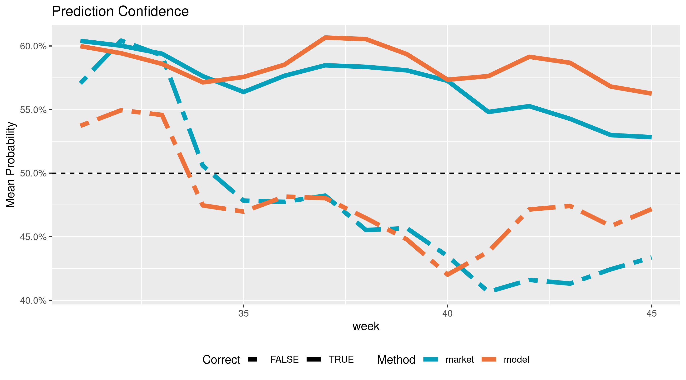

Models and Markets
================

# Introduction

Election prediction helps party officials, campaign operatives, and
journalists interpret campaigns in a quantitative manner. Uncertainty is
key to a useful election prediction.

The forecast model has become a staple of political punditry.
Popularized by the data journalist at
[FiveThirtyEight](https://fivethirtyeight.com/), the forecasting model
is a statistical tool used to incorporate a number of quantitative
inputs and produce a *probabilistic* view of all possible outcomes.

Prediction markets can be used to generate similarly probabilistic views
of election outcomes by utilizing the price discovery and risk aversion
to overcome the ideological bias of self-interested traders on a binary
options exchange.

**Can markets predict elections better than the models? If so, under
what conditions?**

I propose a null hypothesis of no in the proportion of correct
predictions made by forecasting models and prediction markets in the
2018 congressional midterm elections.

# Reproduce

All public input data has been saved on the [internet
archive](https://archive.org/) and can be accessed through their wayback
machine.

Data manipulation is done using the R language and packages from the
[`tidyverse`](https://github.com/tidyverse/) ecosystem.

``` r
# install.package("pacman")
pacman::p_load_gh("hrbrmstr/wayback")
pacman::p_load(
  verification,
  tidyverse,
  lubridate,
  magrittr
)
```

The R scripts in the [`/code`](/code) folder can be run in sequential
order to reproduce the results. There are four scripts to perform four
steps:

1.  Read archived data with `wayback` and `readr`
2.  Wrangle and format with `dplyr` and `tidyr`
3.  Evaluate predictions with `stats` and `verification`
4.  Communicate results with `ggplot2` and `rmarkdown`

<!-- end list -->

``` r
source("code/01_read_inputs.R")
source("code/02_format_inputs.R")
source("code/03_compare_methods.R")
source("code/04_explore_visually.R")
```

# Data

## Forecasting Models

I will be using the FiveThirtyEight “classic” model to represent the
best capabilities of statistical election forecasting. FiveThirtyEight
has a track record of accuracy over the last decade.

[According to Nate Silver](http://53eig.ht/1u2pSbD), “\[the model’s\]
goal is not to divine some magic formula that miraculously predicts
every election. Instead, it’s to make sense of publicly available
information in a rigorous and disciplined way.”

To achieve this, [Silver
explains](https://fivethirtyeight.com/methodology/how-fivethirtyeights-house-and-senate-models-work/)
that most models (**1**) “take lots of polls, perform various types of
adjustments to them, and then blend them with other kinds of empirically
useful indicators to forecast each race”. Importantly, they (**2**)
“account for the uncertainty in the forecast and simulate the election
thousands of times” to generate a probabilistic forecast.

The model incorporates three types of inputs:

1.  **Polling:** District level polling, adjusted by [pollster
    rating](https://projects.fivethirtyeight.com/pollster-ratings/)
2.  **CANTOR:** polling imputation for districts without any
3.  **Fundamentals:** Historically useful non-polling factors:
      - Scandals
      - Incumbency
      - Fundraising
      - Partisanship
      - Generic ballot
      - Previous margin
      - Incumbent voting
      - Challenger office

From this data, the model (**1**) calculates the most likely split of
the vote in a race. (**2**) The probability distribution around this
mean is calculated using proven variables of uncertainty.

The model runs [Monte Carlo
simulation](https://en.wikipedia.org/wiki/Monte_Carlo_method), drawing
elections from the race’s probability distribution. The percentage of
simulated elections won represents the probability of victory.

FiveThirtyEight publishes two files with top-level daily
    predictions:

1.  [`senate_seat_forecast.csv`](https://projects.fivethirtyeight.com/congress-model-2018/senate_seat_forecast.csv)
2.  [`house_district_forecast.csv`](https://projects.fivethirtyeight.com/congress-model-2018/house_district_forecast.csv)

Together, there are **110,000** daily prediction from the “classic”
model with **11** variables:

1.  Date
2.  State
3.  District/Class
4.  Election type
5.  Candidate name
6.  Political party
7.  Model version
8.  **Probability of victory**
9.  Expected share of the vote
10. Minimum share
11. Maximum share

<!-- end list -->

``` r
read_memento(
    url = "https://projects.fivethirtyeight.com/congress-model-2018/house_district_forecast.csv",
    timestamp = "2018-11-06", 
    as = "parsed"
)
```

| Date       | State | District | Party | Incumbent | Probability | Vote Share |
| :--------- | :---- | -------: | :---- | :-------- | ----------: | ---------: |
| 2018-11-05 | AK    |        1 | R     | TRUE      |       0.648 |      51.42 |
| 2018-11-05 | AK    |        1 | D     | FALSE     |       0.352 |      48.58 |
| 2018-11-05 | AL    |        1 | R     | TRUE      |       1.000 |      65.91 |
| 2018-11-05 | AL    |        1 | D     | FALSE     |       0.000 |      34.09 |
| 2018-11-05 | AL    |        2 | R     | TRUE      |       0.978 |      57.93 |

## Prediction Markets

Prediction markets generate probabilistic forecasts by crowd-sourcing
the collection of data from self-interested and risk averse traders.
[The efficient market
hypothesis](https://en.wikipedia.org/wiki/Efficient-market_hypothesis)
holds that asset prices reflect *all* available information (including
forecasting models).

[PredictIt](https://www.predictit.org/) is an exchange run by [Victoria
University](https://www.victoria.ac.nz/) of Wellington, New Zealand. The
site offers a continuous double-auction exchange, where traders buy and
sell shares of futures contracts tied to election outcomes. As a
trader’s perception of probabilities changes, they can sell owned
shares. The market equilibrium price to updates to reflect probability.

PredictIt provided the price history in
[`data/DailyMarketData.csv`](data/DailyMarketData.csv). There are nearly
**45,000** daily predictions from **112** races with **11** variables:

1.  Market ID
2.  Market name
3.  Market symbol
4.  Contract name
5.  Contract symbol
6.  Prediction date
7.  Opening contract price
8.  Low contract price
9.  High contract price
10. **Closing contract price**
11. Volume of shares traded

<!-- end list -->

``` r
read_delim(
  file = "data/DailyMarketData.csv",
  delim = "|",
  col_types = "cccccDddddd",
  na = "n/a"
)
```

| ID   | Market    | Contract      | Date       | Open | Close | Volume |
| :--- | :-------- | :------------ | :--------- | ---: | ----: | -----: |
| 5003 | AKAL.2018 | DEM.AKAL.2018 | 2018-11-05 | 0.42 |  0.28 |    237 |
| 5003 | AKAL.2018 | GOP.AKAL.2018 | 2018-11-05 | 0.74 |  0.72 |    553 |
| 4843 | AZ02.2018 | DEM.AZ02.2018 | 2018-11-05 | 0.91 |  0.98 |    662 |
| 4843 | AZ02.2018 | GOP.AZ02.2018 | 2018-11-05 | 0.10 |  0.05 |    787 |
| 3812 | AZSEN18   | DEM.AZSEN18   | 2018-11-05 | 0.47 |  0.46 |  34137 |

# Wrangle

The above data sets were both formatted to contain key variables:
`date`, `race` and `party`. These are used to join the two data sets for
comparison.

Observations are gathered into a single
[tidy](http://vita.had.co.nz/papers/tidy-data.html) data set, with each
observation representing one prediction (on one day, for one party, from
one source). Redundant complimentary predictions are then removed.

These predictions are compared against the election results to evaluate
the two methods. There are **17,500** predictions across **90** days,
for **111** races. from **2** sources.

``` r
inner_join(markets2, model2) %>%
  filter(date %>% between(17744, 17840)) %>%
  rename(model = prob, 
         market = close) %>% 
  gather(model, market, 
         key = method, 
         value = prob) %>%
  inner_join(results) %>%
  mutate(hit = (prob > 0.50) == winner) %>% 
  mutate(score = (prob - winner)^2) 
```

| Date       | Race  | Party | Method | Probability | Correct | Score |
| :--------- | :---- | :---- | :----- | ----------: | :------ | ----: |
| 2018-08-01 | AZ-S1 | D     | market |       0.660 | TRUE    | 0.116 |
| 2018-08-01 | AZ-S1 | D     | model  |       0.738 | TRUE    | 0.069 |
| 2018-08-01 | CA-12 | D     | market |       0.910 | TRUE    | 0.008 |
| 2018-08-01 | CA-12 | D     | model  |       1.000 | TRUE    | 0.000 |
| 2018-08-01 | CA-22 | D     | market |       0.300 | TRUE    | 0.090 |
| 2018-08-01 | CA-22 | D     | model  |       0.049 | TRUE    | 0.002 |
| 2018-08-01 | CA-25 | D     | market |       0.610 | TRUE    | 0.152 |
| 2018-08-01 | CA-25 | D     | model  |       0.745 | TRUE    | 0.065 |
| 2018-08-01 | CA-39 | D     | market |       0.610 | TRUE    | 0.152 |
| 2018-08-01 | CA-39 | D     | model  |       0.377 | FALSE   | 0.388 |

# Explore


# Results

There is a statistically significant difference between the proportion
of accurate predictions made by the markets and the model.

| Test statistic | df |      P value       | Alternative hypothesis |
| :------------: | :-: | :----------------: | :--------------------: |
|     16.79      | 1  | 4.166e-05 \* \* \* |       two.sided        |

2-sample test for equality of proportions with continuity correction:
`proportion` by `method` (continued below)

| market proportion | model proportion |
| :---------------: | :--------------: |
|      0.8603       |      0.8381      |


This is not the most useful test for predictive usefulness. The model is
generally more confident in both correct and incorrect predictions. The
markets are less likely to be wrong, but they are less confident when
they are right.



[The Brier score](https://en.wikipedia.org/wiki/Brier_score) allows for
probablistic forecasts to be meaningfully tested with mean squared
error. Using this test, there is no statistically significant difference
in the respective skill scores of each predictive method.

| Test statistic |  df   | P value | Alternative hypothesis |
| :------------: | :---: | :-----: | :--------------------: |
|    \-0.339     | 16943 | 0.7346  |       two.sided        |

Welch Two Sample t-test: `score` by `method` (continued below)

| mean in group market | mean in group model |
| :------------------: | :-----------------: |
|        0.1084        |       0.1091        |


