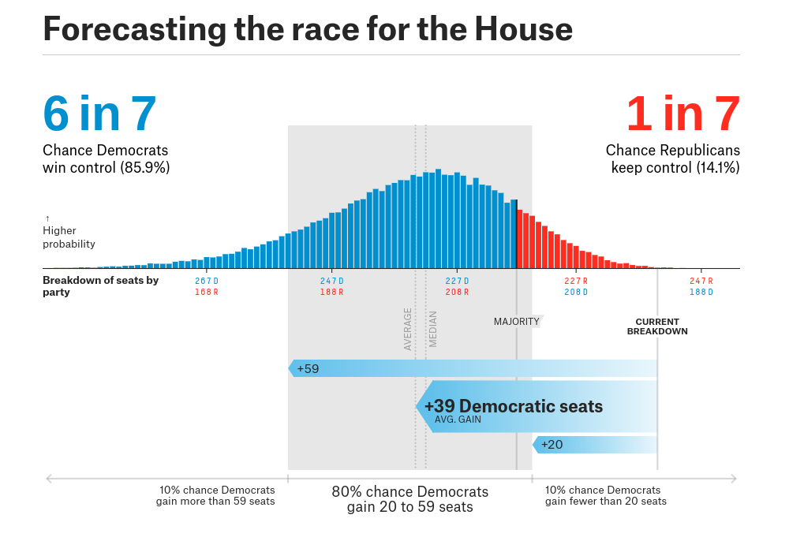
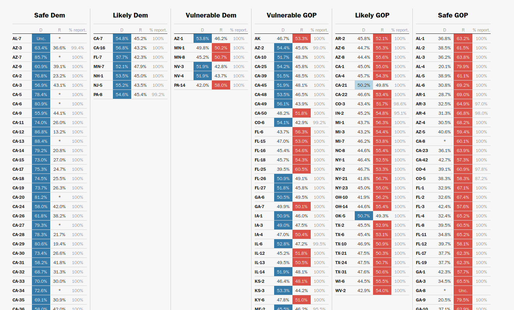

```{r setup, include=FALSE}
knitr::opts_chunk$set(echo = FALSE)
```

```{r libraries, include=FALSE, echo=FALSE}
library(tidyverse)
library(rvest)
library(magrittr)
```

## Why predict elections?

* Resource allocation
* Strategy adjustment
* Quantitative journalism

## How to Predict Elections

1. Opinion polling
2. Polling aggregation
3. Forecast modeling
4. Prediction markets

## Opion Polling

_e.g., Washington Post/ABC_

In 1824 _The Harrisburg Pennsylvanian_ had Jackson over Adams, 335 to 169.

* Sample Size
* Methodology
* Partisanship

## Polling Aggrigation

_e.g., RealClearPolitics_

* 21st century invention
* Average out all polls
* Minimize errors and reduce bias
* Possibly weighted

## Forecasting Models

Montel carlo simulations = probability distribution

1. Define a domain of possible inputs
2. Generate inputs randomly from a probability distribution over the domain
3. Perform a deterministic computation on the inputs
4. Aggregate the results

* Draw share of vote, compared
* 20,000 interations
* Law of large numbers

## About FiveThirtyEight

* Founded in 2008, sold to NYT then ABC
* Least inaccurate in 2016

> Someone could look like a genius simply by doing some fairly basic research
into what really has predictive power in a political campaign

## FiveThirtyEight Forecast

> It takes lots of polls, performs various types of adjustments to them, and
then blends them with other kinds of empirically useful indicators... Then it
accounts for the uncertainty in the forecast and simulates the election
thousands of times.

1. **Polling**: District-by-district polling, adjusted for house effects and
other factors.
2. **CANTOR**: Infers results for districts with little or no polling from
comparable districts with polling.
3. **Fundamentals**: District partisanship, past performance, generic ballot,
fundraising, experience, scandals

Trained off elections since 1998. Only miscalled 3.3% of past races.

## Model Uncertainty


## Model Data
```{r model history, echo=FALSE}
model_history <- 
  read_csv("./data/model_history.csv",
           col_types = cols()) %>% 
  select(-last)

print(model_history)
```

## Prediction Markets

In 1503 traders bet on Papal successor. Iowa Election Market founded in 1988.

* Exchange-traded markets
* Binary options
* Contract price = probability
* Crowd-sourcing
* Efficient market hypothesis
* Price equilibrium
* Risk aversion

## PredictIt

> PredictIt is a unique and exciting real money site that tests your knowledge
of political events by letting you trade shares on everything from the outcome
of an election to a Supreme Court decision to major world events… PredictIt is
run by Victoria University of Wellington, New Zealand, a not-for-profit
university, for educational purposes

## PredictIt Contracts

* Real money
* Elections, Justice, Administration, World
* Futures contracts
  * Two buyers
  * Executes at time or condition
  * Either $1 or $0
  * Sell at any time

## PredictIt Markets

* Will Donald Trump be president at year-end 2018?
* Will the federal government be shut down on February 9?
* Will Ted Cruz be re-elected to the U.S. Senate in Texas in 2018?
* Will Facebook’s Mark Zuckerberg run for president in 2020?
* How many tweets will @realDonaldTrump post from noon Oct. 10 to noon Oct. 17?

## PredicIt Data


## PredictIt Data Collection

1. Get all active relevant market names from API
2. Grab chart data from all above markets
3. Merge chart data with API names
4. Turn market names into district codes and party affiliation

## Scraped Market Data
```{r market info, echo=FALSE, message=FALSE, warning=FALSE}
market_data <- read_csv("./data/market_data.csv",
                        col_types = cols())

print(market_data)
```

## Market API Names

* Which party will win GA-07?
* Which party will win AK at-large?
* Will Brian Fitzpatrick be re-elected?
* Which party will win MS Senate special?
* Will Pelosi be re-elected?
* Will a Dem candidate win the 2018 House of Reps race in WA's 3rd district?

## Formatting Names

```{r ifelse, eval=FALSE, echo=TRUE}
if_else(str_detect(market_history$code, "re-elected"),
        true = word(market_history$code, 3),
        false = 
  if_else(str_detect(market_history$code, "at-large"),
          true = paste(word(market_history$code, 5), "01", sep = "-"),
          false = 
    if_else(str_detect(market_history$code, "special"),
            true = paste(word(market_history$code, 5), "98", sep = "-"),
            false = 
      if_else(str_detect(market_history$code, "Senate"),
              true = paste(word(market_history$code, 5), "99", sep = "-"),
              false = 
        if_else(str_detect(market_history$code, "re-elected"),
                true = word(market_history$code, 3),
                false = 
          if_else(str_detect(market_history$code, "Which party"),
                  true = word(market_history$code, 5), "ERROR"))))))
```


## Market Data Combination

```{r market history, echo=FALSE, message=FALSE, warning=FALSE}
market_history <- read_csv("./data/market_history.csv",
                           col_types = cols())

print(market_history)
```

## Joining Markets and Models

```{r joined, echo=FALSE, message=FALSE, warning=FALSE}
joined <- 
  read_csv("./data/joined.csv",
           col_types = cols(mid = col_character(),
                            cid = col_character())) %>% 
  mutate(party = recode(party, "I" = "D"))

joined %>% 
  select(-name, -chamber, -incumbent) %>% 
  print()
```

## Tidy Data

```{r joined tidy, echo=FALSE, message=FALSE, warning=FALSE }
joined_tidy <- 
  joined %>%
  gather(prob, price,
         key = tool,
         value = prob) %>%
  mutate(tool = recode(tool,
                       "price" = "market",
                       "prob" = "model")) %>% 
  filter(date < "2018-11-06") %>% 
  select(date, name, code, party, tool, prob) %>%
  arrange(date, code)

print(joined_tidy)
```

## Probability Boxplots

```{r prob box, echo=FALSE, message=FALSE, warning=FALSE}
ggplot(joined_tidy) +
  geom_boxplot(aes(y = prob, fill = party, ymin = 0.05)) +
  facet_wrap(~ tool) +
  scale_fill_manual(values = c("royalblue2", "red2"))
```

## Probability by Tool

```{r prob tool, echo=FALSE, message=FALSE, warning=FALSE}
ggplot(joined_tidy, 
       mapping = aes(x = date,
                     y = prob)) +
  geom_smooth(aes(color = party,
                  linetype = tool)) +
  scale_color_manual(values = c("blue", "red")) +
  labs(title = "Probability By Tool and Party",
       x = "Probability of Victory",
       y = "Date")
```

## Difference in Tools

```{r diff, echo=FALSE, message=FALSE, warning=FALSE}
ggplot(joined,
       aes(x = date,
           y = price - prob,
           color = party,
           linetype = incumbent)) +
  geom_smooth() +
  scale_color_manual(values = c("blue", "red")) +
  scale_linetype_manual(values = c("twodash", "solid")) +
  ggtitle("Difference in Market Pice and Model Probability Over Time") +
  xlab("Date") +
  ylab("Market Price - Model Prob") +
  geom_hline(yintercept = 0)
```

## AP Election Results


## Scraping Results

```{r results, echo=FALSE, message=FALSE, warning=FALSE}
election_results <- read_csv("./data/election_results.csv",
                             col_types = cols())
election_results$class <- factor(election_results$class,
                                 levels = c("safe D",
                                            "lkly D",
                                            "vul D",
                                            "vul R",
                                            "lkly R",
                                            "safe R"))

print(election_results)
```

## Cook Race Classifications

```{r class all, echo=FALSE, message=FALSE, warning=FALSE}
ggplot(election_results) +
  geom_bar(aes(x = class)) +
  labs(title = "Number of Races by Cook Report Classification",
       subtitle = nrow(election_results),
       y = "Number of Race",
       x = "Cook Political Report Classification") +
  scale_x_discrete(labels = c("Safe Dem",
                              "Likely Dem",
                              "Vulnerable Dem",
                              "Vulnerable Rep",
                              "Likely Rep",
                              "Safe Rep"))
```

## Cook Race Classifications

```{r class market, echo=FALSE, message=FALSE, warning=FALSE}
ggplot(filter(election_results, code %in% joined$code)) +
  geom_bar(aes(x = class)) +
  labs(title = "Number of Races by Cook Report Classification",
       subtitle = nrow(filter(election_results, code %in% joined$code)),
       y = "Number of Race",
       x = "Cook Political Report Classification") +
  scale_x_discrete(labels = c("Safe Dem",
                              "Likely Dem",
                              "Vulnerable Dem",
                              "Vulnerable Rep",
                              "Likely Rep",
                              "Safe Rep"))
```

## Post-Election Results

1. Any given time, >50% is a predicted winner
2. For each day, ask if guess matches winner
3. Average across all races
4. Plot over time

## Accuracy Over Time

```{r accuracy, echo=FALSE, message=FALSE, warning=FALSE}
accuracy <- read_csv("./data/accuracy.csv",
                     col_types = cols())

ggplot(accuracy) +
  geom_smooth(aes(x = day,
                  y = accuracy,
                  color = tool)) +
  labs(title = "Accuracy of Prediction Tools Over Time",
       subtitle = "Of Most Competitive Races",
       y = "Percent Accurately Predicted",
       x = "Date")
```

