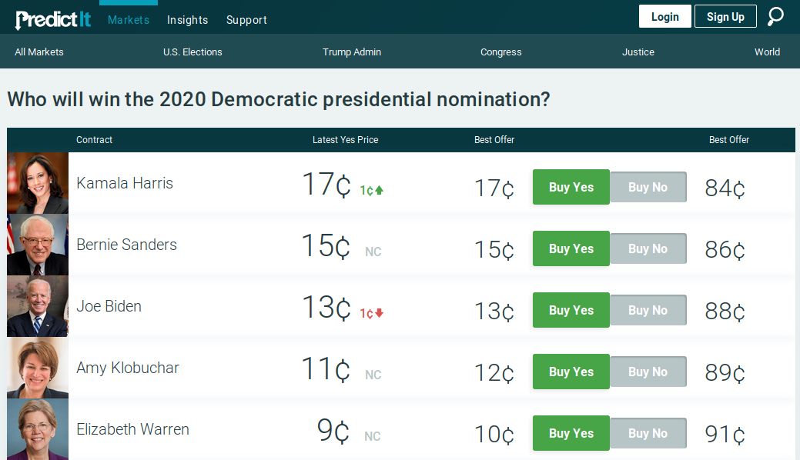
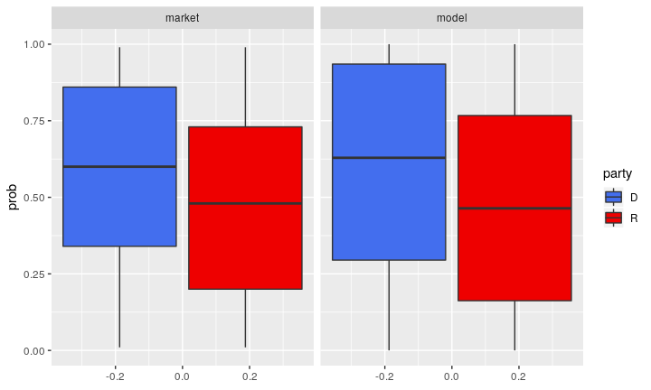
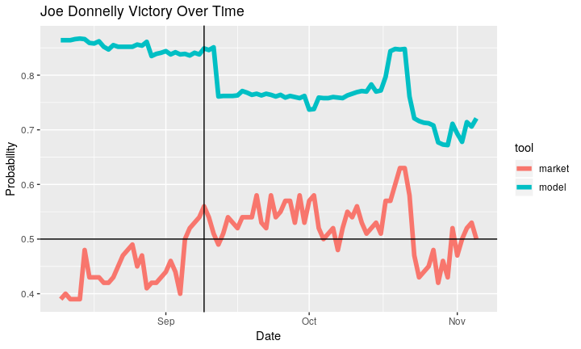
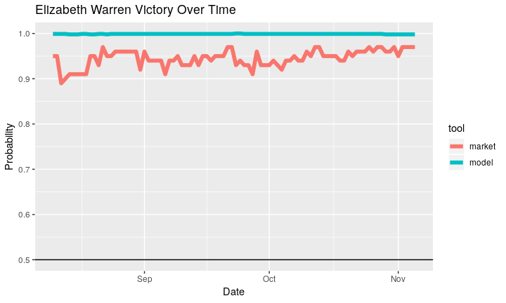
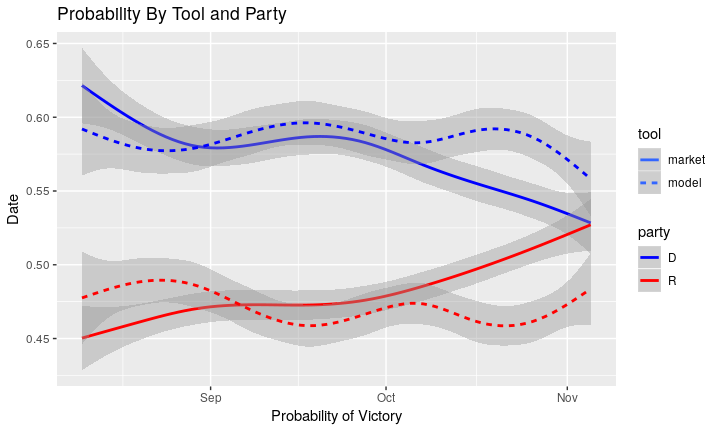
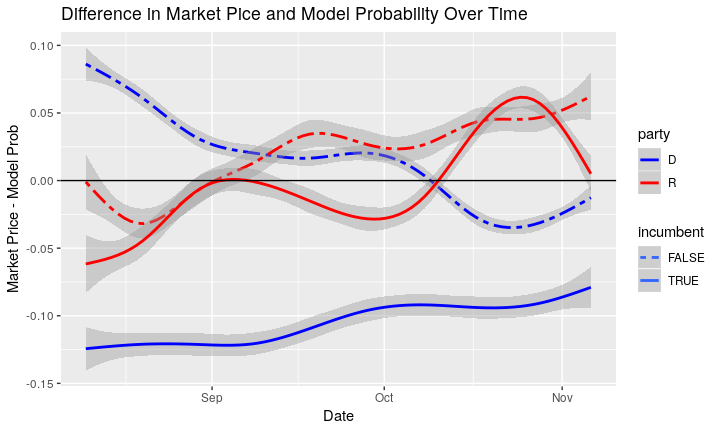
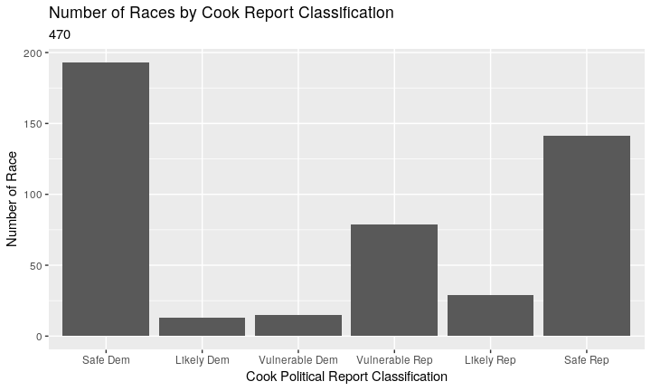
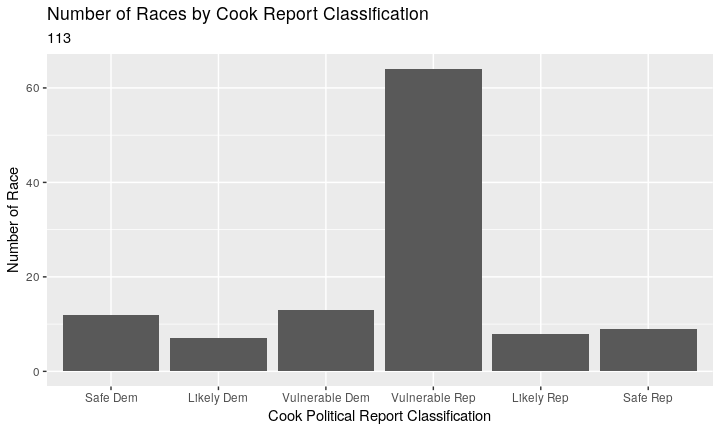
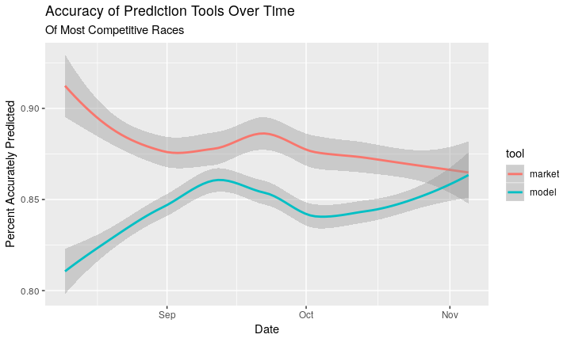

## Why predict elections?

* Resource allocation
* Strategy adjustment
* Quantitative journalism
* Uncertainty is scary

## How to Predict Elections

1. Opinion polling
2. Polling aggregation
3. Forecast modeling
4. Prediction markets

## Opion Polling

_e.g., Washington Post/ABC_

In 1824 _The Harrisburg Pennsylvanian_ had Jackson over Adams, 335 to 169.

* Sample Size
* Methodology
* Partisanship

## Polling Aggrigation

_e.g., RealClearPolitics_

* 21st century invention
* Average out all polls
* Minimize errors and reduce bias
* Possibly weighted

## Forecasting Models

Montel carlo simulations = probability distribution

1. Define a domain of possible inputs
2. Generate inputs randomly from a probability distribution over the domain
3. Perform a deterministic computation on the inputs
4. Aggregate the results

* Poll, average, deviation
* 20,000 interations
* Law of large numbers

## About FiveThirtyEight

* Founded in 2008, sold to NYT then ABC
* Least inaccurate in 2016 (Clinton @ 71%)

> Someone could look like a genius simply by doing some fairly basic research
into what really has predictive power in a political campaign

> — Nate Silver

## FiveThirtyEight Forecast

> It takes lots of polls, performs various types of adjustments to them, and
then blends them with other kinds of empirically useful indicators... Then it
accounts for the uncertainty in the forecast and simulates the election
thousands of times.

1. **Polling**: District-by-district polling, adjusted for house effects and
other factors.
2. **CANTOR**: Infers results for districts with little or no polling from
comparable districts with polling.
3. **Fundamentals**: District partisanship, past performance, generic ballot,
fundraising, experience, scandals

## Model Data

```
## # A tibble: 89,918 x 6
##    date       chamber code  party voteshare  prob
##    <date>     <chr>   <chr> <chr>     <dbl> <dbl>
##  1 2018-08-01 senate  AZ-99 D         0.511 0.738
##  2 2018-08-01 senate  AZ-99 R         0.461 0.262
##  3 2018-08-01 senate  CA-99 D         0.636 0.999
##  4 2018-08-01 senate  CA-99 D         0.364 0.001
##  5 2018-08-01 senate  CT-99 D         0.641 0.999
##  6 2018-08-01 senate  CT-99 R         0.324 0.001
##  7 2018-08-01 senate  DE-99 D         0.607 0.989
##  8 2018-08-01 senate  DE-99 R         0.367 0.011
##  9 2018-08-01 senate  FL-99 D         0.511 0.616
## 10 2018-08-01 senate  FL-99 R         0.489 0.384
## # ... with 89,908 more rows
```

## Prediction Markets

In 1503 traders bet on Papal successor. Iowa Election Market founded in 1988.

* Exchange-traded markets
* Binary options
* Contract price = probability
* Crowd-sourcing
* Efficient market hypothesis
* Price equilibrium
* Risk aversion

## PredictIt

> PredictIt is a unique and exciting real money site that tests your knowledge
of political events by letting you trade shares on everything from the outcome
of an election to a Supreme Court decision to major world events… PredictIt is
run by Victoria University of Wellington, New Zealand, a not-for-profit
university, for educational purposes

## PredictIt Contracts

* Real money
* Elections, Justice, Administration, World
* Futures contracts
  * Two buyers
  * Executes at time or condition
  * Either $1 or $0
  * Sell at any time

## PredictIt Markets

* Will Donald Trump be president at year-end 2018?
* Will the federal government be shut down on February 9?
* Will Ted Cruz be re-elected to the U.S. Senate in Texas in 2018?
* Will Facebook’s Mark Zuckerberg run for president in 2020?
* How many tweets will @realDonaldTrump post from noon Oct. 10 to noon Oct. 17?

## PredictIt Markets


## PredicIt Data


## PredictIt Data Collection

1. Get all active relevant market names from API
2. Grab chart data from all above markets
3. Merge chart data with API names
4. Turn market names into district codes and party affiliation

## Scraped Market Data

```
## # A tibble: 24,556 x 5
##    date       mid   cid   price volume
##    <date>     <chr> <chr> <dbl>  <dbl>
##  1 2018-08-10 2918  5264   0.95     56
##  2 2018-08-11 2918  5264   0.95     50
##  3 2018-08-12 2918  5264   0.89    100
##  4 2018-08-13 2918  5264   0.9      40
##  5 2018-08-14 2918  5264   0.91     61
##  6 2018-08-15 2918  5264   0.91     85
##  7 2018-08-16 2918  5264   0.91     59
##  8 2018-08-17 2918  5264   0.91      0
##  9 2018-08-18 2918  5264   0.91      0
## 10 2018-08-19 2918  5264   0.95     50
## # ... with 24,546 more rows
```

## Market API Names

* Which party will win GA-07?
* Which party will win AK at-large?
* Will Brian Fitzpatrick be re-elected?
* Which party will win MS Senate special?
* Will Pelosi be re-elected?
* Will a Dem candidate win the 2018 House of Reps race in WA's 3rd district?

## Formatting Names


```r
if_else(str_detect(market_history$code, "re-elected"),
        word(market_history$code, 3),
if_else(str_detect(market_history$code, "at-large"),
        paste(word(market_history$code, 5), "01", sep = "-"),
if_else(str_detect(market_history$code, "special"),
        paste(word(market_history$code, 5), "98", sep = "-"),
if_else(str_detect(market_history$code, "Senate"),
        paste(word(market_history$code, 5), "99", sep = "-"),
if_else(str_detect(market_history$code, "re-elected"),
        word(market_history$code, 3),
if_else(str_detect(market_history$code, "Which party"),
        word(market_history$code, 5), "ERROR"))))))
```


## Market Data Combination


```
## # A tibble: 24,466 x 7
##    date         mid   cid price volume code  party
##    <date>     <dbl> <dbl> <dbl>  <dbl> <chr> <chr>
##  1 2018-08-10  2918  5264  0.95     56 MA-99 D    
##  2 2018-08-11  2918  5264  0.95     50 MA-99 D    
##  3 2018-08-12  2918  5264  0.89    100 MA-99 D    
##  4 2018-08-13  2918  5264  0.9      40 MA-99 D    
##  5 2018-08-14  2918  5264  0.91     61 MA-99 D    
##  6 2018-08-15  2918  5264  0.91     85 MA-99 D    
##  7 2018-08-16  2918  5264  0.91     59 MA-99 D    
##  8 2018-08-17  2918  5264  0.91      0 MA-99 D    
##  9 2018-08-18  2918  5264  0.91      0 MA-99 D    
## 10 2018-08-19  2918  5264  0.95     50 MA-99 D    
## # ... with 24,456 more rows
```

## Joining Markets and Models


```
## # A tibble: 24,555 x 6
##    date       code  party  prob price volume
##    <date>     <chr> <chr> <dbl> <dbl>  <dbl>
##  1 2018-08-10 MA-99 D     0.999  0.95     56
##  2 2018-08-10 TX-99 R     0.742  0.7    1303
##  3 2018-08-10 VT-99 D     1      0.95    542
##  4 2018-08-10 WV-99 D     0.859  0.75    533
##  5 2018-08-10 IN-99 D     0.864  0.39     12
##  6 2018-08-10 CA-12 D     1      0.9      51
##  7 2018-08-10 ND-99 D     0.594  0.42     81
##  8 2018-08-10 MO-99 D     0.733  0.47    333
##  9 2018-08-10 WI-99 D     0.977  0.83      0
## 10 2018-08-10 MI-99 D     0.985  0.79    390
## # ... with 24,545 more rows
```

## Tidy Data


```
## # A tibble: 46,138 x 5
##    date       code  party tool    prob
##    <date>     <chr> <chr> <chr>  <dbl>
##  1 2018-08-10 AZ-99 R     model  0.272
##  2 2018-08-10 AZ-99 R     market 0.02 
##  3 2018-08-10 CA-12 D     model  1    
##  4 2018-08-10 CA-12 D     market 0.9  
##  5 2018-08-10 CA-22 R     model  0.96 
##  6 2018-08-10 CA-22 R     market 0.65 
##  7 2018-08-10 CA-49 R     model  0.197
##  8 2018-08-10 CA-49 R     market 0.03 
##  9 2018-08-10 CA-99 D     model  0.999
## 10 2018-08-10 CA-99 D     model  0.001
## # ... with 46,128 more rows
```

## Probability Boxplots

<!-- -->

## Probability Over Time

<!-- -->

## Probability Over Time
<!-- -->


## Probability by Tool

<!-- -->

## Difference in Tools

<!-- -->

## Scraping Results


```
## # A tibble: 470 x 5
##    code    dem   rep class  winner
##    <chr> <dbl> <dbl> <fct>  <chr> 
##  1 AK-01 0.46  0.54  vul R  R     
##  2 AL-01 0.367 0.633 safe R R     
##  3 AL-02 0.385 0.615 safe R R     
##  4 AL-03 0.362 0.638 safe R R     
##  5 AL-04 0.201 0.799 safe R R     
##  6 AL-05 0.389 0.611 safe R R     
##  7 AL-06 0.307 0.693 safe R R     
##  8 AL-07 1     0     safe D D     
##  9 AR-01 0.287 0.69  safe R R     
## 10 AR-02 0.458 0.521 lkly R R     
## # ... with 460 more rows
```

## Cook Race Classifications

<!-- -->

## Cook Race Classifications

<!-- -->

## Post-Election Results

1. Any given time, > 50% is a predicted winner
2. For each day, ask if guess matches winner
3. Average across all races
4. Plot over time

## Accuracy Over Time

<!-- -->

## Conclusion

```
## 
## <table style="text-align:center"><tr><td colspan="8" style="border-bottom: 1px solid black"></td></tr><tr><td style="text-align:left">Statistic</td><td>N</td><td>Mean</td><td>St. Dev.</td><td>Min</td><td>Pctl(25)</td><td>Pctl(75)</td><td>Max</td></tr>
## <tr><td colspan="8" style="border-bottom: 1px solid black"></td></tr></table>
```

* Methods converge
* With lack of polling, markets have value
* Underestimate Incumbent Democrats

