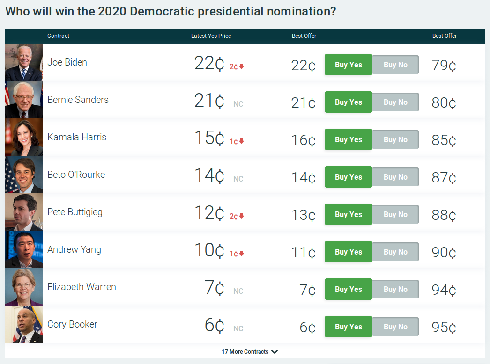

```{r setup, include=FALSE}
library(tidyverse)
library(rvest)
library(magrittr)
library(knitr)
opts_chunk$set(echo = FALSE,
               warning = FALSE,
               message = FALSE,
               error = FALSE)
```

```{r read, cache=TRUE}
source("./code/01_scrape_inputs.R")
```

```{r format}
source("./code/02_format_inputs.R")
```

```{r compare}
source("./code/03_compare_methods.R")
```

```{r}
source("./code/04_explore_visually.R")
```

## Why predict elections?

* Resource allocation
* Strategy adjustment
* Quantitative journalism
* Uncertainty is scary

## How to Predict Elections

1. Opinion Polls
1. Poll Aggregation
1. Forecast Models
1. Prediction Markets

## Onion Polling

Ex: _Washington Post/ABC_

* Simple random sampling
* Response rates
* Sample size
* Statistical bias
* Partisanship

In 1824, _The Harrisburg Pennsylvanian_ had Jackson over Adams, 335 to 169.

_Literary Digest_ starting polling nationally in 1916. Infamously "sampled" 2.3
million readers in 1936 and bias caused them to predict Landon over over
Roosevelt.

## Polling Aggregation

Ex: _RealClearPolitics.com_

* 21st century invention
* Average out all polls
* Law of large numbers
* Minimize errors and reduce bias

## Forecasting Models

> (Forecasting models) take lots of polls, perform various types of adjustments
to them, and then blend them with other kinds of empirically useful
indicators... to forecast each race. Then they account for the uncertainty in
the forecast and simulate the election thousands of times.

## Forecasting Models

> Most election models (including [FiveThirtyEight’s]) work in something like the following way: First, they calculate the most likely outcome in a particular state (“The Republican wins by 1 point”) and then they determine the degree of uncertainty around that estimate. Most models do this by means of a normal distribution or something similar to it.

Historic indicators of _greater_ uncertainty:

1. The election is further away in time
1. There are fewer polls
1. Those polls disagree more with one another
1. The polling average disagrees more with the state fundamentals
1. There are more undecideds or third-party voters in the polls
1. The race is more lopsided


## Model Inputs

1. **Polling:** District level polling. FiveThirtyEight rates pollsters to
adjust their findings. Further adjusted for  recency and other factors.
1. **CANTOR:** A proprietary k-nearest neighbors algorithm to identify similar
congressional districts to infers results for polling-sparce districts.
1. **Fundamentals:** Non-polling factors that historically help in predicting
congressional races:
    * Incumbency
    * Partisanship
    * Previous margin
    * Generic ballot
    * Fundraising
    * Scandals
1. **Expert forecasts:** Ratings published by the historically accurate experts.

## Model Outputs

```{r model_data, warning=FALSE, message=FALSE}
house_district_forecast %>% 
  select(forecastdate,
         state,
         district,
         party,
         incumbent,
         win_probability,
         voteshare) %>%
  filter(party == "D" | party == "R") %>% 
  slice(1:10) %>%
  arrange(forecastdate) %>% 
  kable(digits = 2,
        col.names = c("Date",
                      "State",
                      "District",
                      "Party",
                      "Incumbent",
                      "Prob",
                      "Share"),
        caption = "Model Data (299,760 observations with 7 of 12 variables)")
```

## Prediction Markets

* Exchange-traded binary options markets
* Contract price reflects probability
* Crowd-sourcing information
* Efficient market hypothesis
* Price discovery through equilibrium
* Risk aversion overcomes bias
* Dubious legality in the United States

In 1503, traders bet on Papal successor.

Iowa Election Market founded in 1988.

## PredictIt

> PredictIt is a unique and exciting real money site that tests your knowledge
of political events by letting you trade shares on everything from the outcome
of an election to a Supreme Court decision to major world events... PredictIt is
run by Victoria University of Wellington, New Zealand, a not-for-profit
university, for educational purposes

## PredictIt Contracts

* Real money, $850 limit imposed by CFTC
* Elections, Justice, Administration, World
* Futures contracts, executes at time or condition
* Two buyers on either side
* Execute for \$1 or \$0 based on outcome
* Traders can sell at any time, price change reflects information

## PredictIt Markets

* Who will win the 2020 Democratic presidential nomination?
* Will Donald Trump be impeached in his first term?
* Will Congress ratify the USMCA by year-end 2019?
* Will Facebook’s Mark Zuckerberg run for president in 2020?
* How many tweets will @realDonaldTrump post from noon Mar. 22 to noon Mar. 29?
* Will Theresa May be prime minister of the United Kingdom on 6/30?

## 



## PredicIt Data

```{r market_data, warning=FALSE, message=FALSE}
DailyMarketData %>% 
  select(MarketId, MarketSymbol, Date, ClosePrice, Volume) %>% 
  sample_n(10) %>%
  arrange(Date) %>% 
  kable(digits = 3,
        col.names = c("ID", "Ticker", "Date", "Price", "Volume"),
        caption = "Market Data (44,711 observations with 6 of 11 variables)")
```


## Messy Data

```{r}
messy %>%
  slice(1:10) %>% 
  kable(digits = 3,
        col.names = c("Date", "Race", "Market Price", "Model Probability"),
        caption = "Messy Combined (9,200 observations of 4 variables)")
```

## Tidy Data

```{r}
tidy %>%
  slice(1:10) %>% 
  kable(digits = 3,
        col.names = c("Date", "Race", "Predictive Method", "Probability"),
        caption = "Tidy Combined (18,400 observations of 4 variables)")
```

## Race Distributions

```{r plot_races_hist}
plot_races_hist + 
  theme_minimal() + 
  ggtitle("", subtitle = "") +
  theme(legend.position = "none")
```

## Method Similarities

```{r plot_cartesian_races}
plot_cartesian_races + 
  theme_minimal() + 
  ggtitle("", subtitle = "")
```

## Market Manipulation?

```{r plot_nj_02}
plot_nj_02 + 
  theme_minimal() + 
  ggtitle("", subtitle = "")
```

## Method Accuracy

```{r prop_day_line}
prop_day_line + 
  theme_minimal() + 
  ggtitle("", subtitle = "")
```

## Method Accuracy

```{r prop_month_bars}
prop_month_bars + 
  theme_minimal() + 
  ggtitle("", subtitle = "")
```
